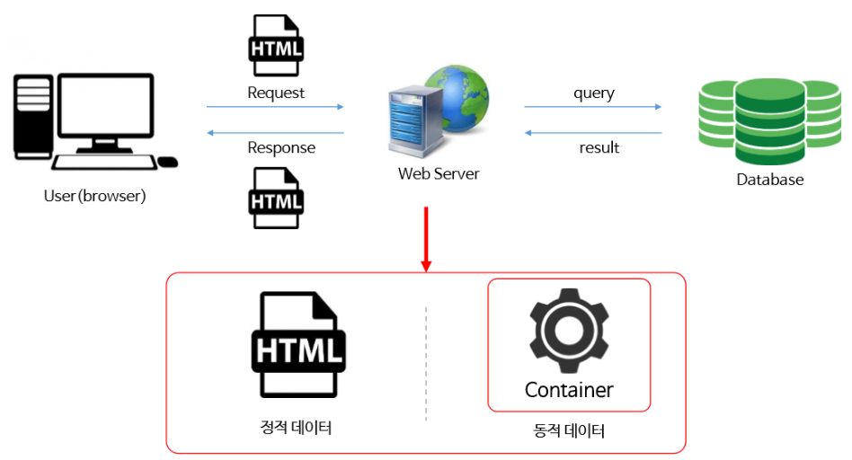
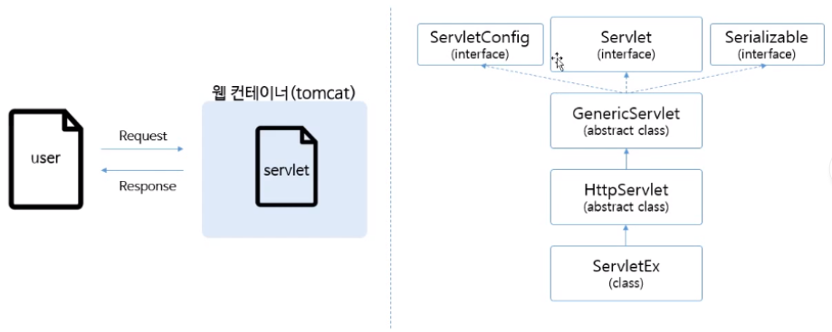

학원에서 배웠던 내용을 다시 상기시킬 겸 JSP 개념을 다시 정리하기로 했다.

1. 웹 프로그램의 동작 원리



동적인 데이터 처리는 웹컨테이너를 이용해서 동적데이터 응답
정적 데이터라면 HTML로 응답

2. Servlet Mapping
보안에 취약하고 복잡한 풀 Servlet 이름을 간결하고 보안에 취약하지 않게 바꾸는 것

Mapping 방법에는 두 가지가 있다.

* web.xml 을 이용한 Mapping
``` xml
<servlet>
  	<servlet-name>HelloServlet</servlet-name>
  	<servlet-class>com.testPjt.HelloServlet</servlet-class>
</servlet>
<servlet-mapping>
    <servlet-name>HelloServlet</servlet-name>
    <url-pattern>/hs</url-pattern>
</servlet-mapping>
```
web.xml 문서에 위에 코드와 같이 servlet을 등록하고 그 servlet을 어떻게 mapping 할지 설정하면 된다.

* Java Annotation
web.xml 보다는 조금 현대적인(?) 방법
```
@WebServlet("/hs")
```
이렇게 추가만 해주면 됨
<br />

3. Servlet request, response
* HttpServlet

이렇게 많은 인터페이스와 추상클래스를 상속받아서 서블렛을 만드는 이유는 로컬에서 작업하는 것이 아니라 웹서버와의 통신에서 많은 데이터가 오고가는데 그 사이에서 많은 기능들이 필요하기 때문이다.


* HttpServletRequest
요청에 대한 정보를 가지고 있는 객체
```
request.getCookies();
request.getSession();
request.getAttribute();
request.getParameter();
request.getParameterNames();
request.getParameterValues();

```

* HttpServletResponse
응답에 대한 정보를 가지고 있는 객체
```
response.addCookie();
response.getStatus();
response.sendRedirect();
response.getWriter();
response.getOutputStream();
```

<br />
출처: 인프런 "실전 JSP" / 