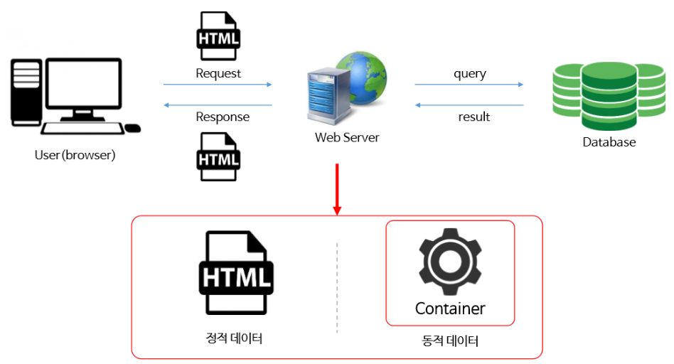
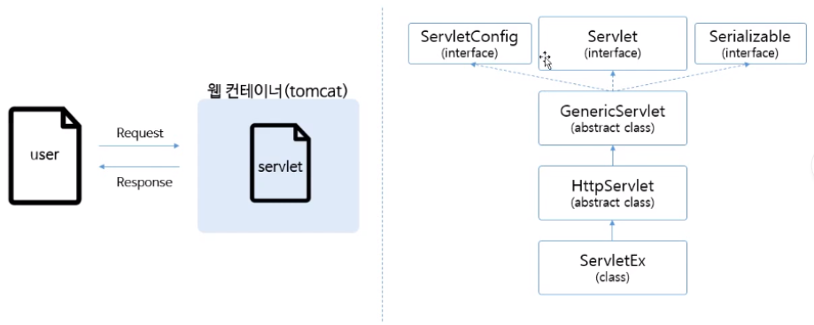
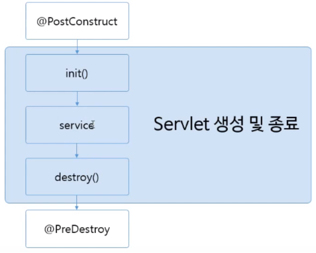
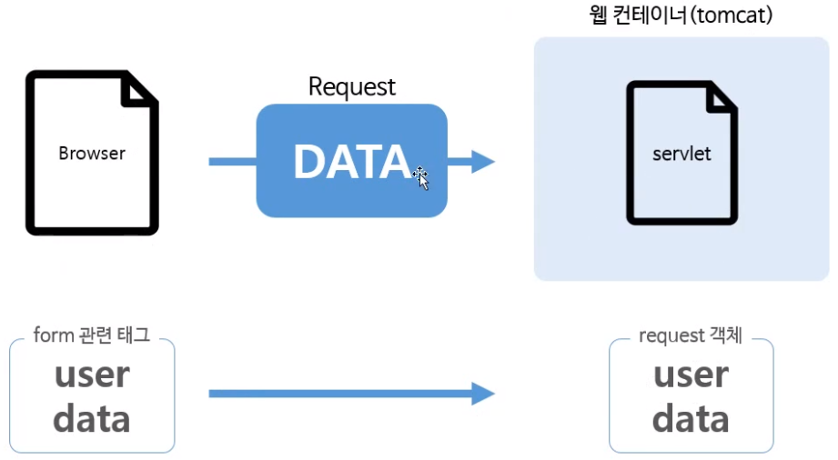

학원에서 배웠던 내용을 다시 상기시킬 겸 JSP 개념을 다시 정리하기로 했다.
<br />

웹 프로그램의 동작 원리
---
<hr />



동적인 데이터 처리는 웹컨테이너를 이용해서 동적데이터 응답
정적 데이터라면 HTML로 응답

<br />

Servlet Mapping
---
<hr />
보안에 취약하고 복잡한 full Servlet 이름을 간결하고 보안에 취약하지 않게 바꾸는 것

Mapping 방법에는 두 가지가 있다.

### 1) web.xml 을 이용한 Mapping

```xml
<servlet>
  	<servlet-name>HelloServlet</servlet-name>
  	<servlet-class>com.testPjt.HelloServlet</servlet-class>
</servlet>
<servlet-mapping>
    <servlet-name>HelloServlet</servlet-name>
    <url-pattern>/hs</url-pattern>
</servlet-mapping>
```

web.xml 문서에 위에 코드와 같이 servlet을 등록하고 그 servlet을 어떻게 mapping 할지 설정하면 된다.

### 2) Java Annotation
web.xml 보다는 조금 현대적인(?) 방법
```
@WebServlet("/hs")
```
이렇게 추가만 해주면 됨

<br />

Servlet request, response
---
<hr />

### 1) HttpServlet


이렇게 많은 인터페이스와 추상클래스를 상속받아서 서블렛을 만드는 이유는 로컬에서 작업하는 것이 아니라 웹서버와의 통신에서 많은 데이터가 오고가는데 그 사이에서 많은 기능들이 필요하기 때문이다.


### 2) HttpServletRequest
요청에 대한 정보를 가지고 있는 객체

<br />

대표적인 메소드들은 아래와 같다.

```java
request.getCookies();
request.getSession();
request.getAttribute();
request.getParameter();
request.getParameterNames();
request.getParameterValues();
```

### 3) HttpServletResponse
응답에 대한 정보를 가지고 있는 객체

<br />

대표적인 메소드들은 아래와 같다.

```java
response.addCookie();
response.getStatus();
response.sendRedirect();
response.getWriter();
response.getOutputStream();
```

<br />

Servlet Life-Cycle
---
<hr />


init: servlet이 시작하는 단계<br>
service: get / post 방식으로 서비스가 진행되고 있는 단계<br>
destroy: servlet이 소멸되는 단계

<br />
실행순서: PC -> init -> service(get/post) -> destroy -> PD

<br />

form 데이터 처리
---
<hr />

### - form 태그


브라우저를 이용해서 데이터를 request로 날린다.<br>
서버에서는 request 객체를 들여다보면 user에서 보낸 데이터들이 들어있음.<br>

form 태그로 둘러싸서 데이터를 보내는 방식에는 두가지가 있다.<br>

#### 1) doGet

데이터가 웹 브라우저 URL에 노출되어 웹 서버로 전송<br>
method 설정 생략의 경우 get방식이 default<br>
사용자 정보가 URL에 노출<br>
너무많은 데이터를 보내지 못함<br>

#### 2) doPost
데이터가 HTTP Request에 포함되어 웹 서버로 전송<br>
URL에 맵핑 정보만 노출<br>
보안에 강하기 때문에 로그인, 회원가입, 설문조사 등에 사용<br>


<br />
<br />
출처: 인프런 "실전 JSP" / 