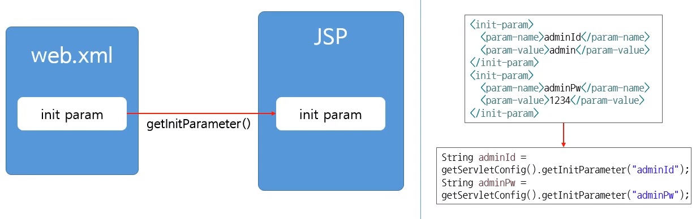

저번 글에 이어 JSP 강의를 듣고 정리한 내용
<br />

JSP 주요 스크립트
---
<hr />

### 1) 선언 태그
JSP 페이지에서 Java의 멤버변수 또는 메서드를 선언<br />
<%! %> 형태

```jsp
<%!
	int num = 10;
	String str = “jsp”;
	ArrayList<String> list = new ArrayList<String>();

	public void jspMethod(){
		System.out.println(“jspMethod”);
}
%>
```

### 2) 주석 태그
<%--   --%>

### 3) 스트립트릿 태그
JSP 페이지에서 Java 코드를 넣기 위한 태그<br />
<% %>

```jsp
	<%
		if(num > 0){
	%>
	<p>num > 0</p>
	<%
		}else{
	%>
	<p>num <= 0</p>
	<%
		}
	%>
```

### 4) 표현식 태그
Java의 변수 및 메서드의 반환값을 출력하는 태그
```jsp
<%= num %>
```

### 5) 지시어
서버에서 jsp페이지를 처리하는 방법에 대한 정의<br />

1. page: 페이지 기본 설정 -> <% page 속성=”속성 값”>
```jsp
<%@ page language=”java” contentType=”text/html; charset=UTF-8” pageEncoding=”UTF-8” %>
```
2. include: include file 설정 -> <% include file=”파일명”>
```jsp
<%@ include file =”header.jsp” %>
```

3. taglib: 외부라이브러리 태그 설정 -> <% taglib uri=”uri” prefix=”네임스페이스명”>
```jsp
<%@ taglib uri=”http://java.sun.com/jsp/jstl/core” prefix=”c” %>
```

JSP 내장객체
---
<hr />

### 1) config
해당 servlet에서만 데이터가 공유

config.getInitParameter() 이렇게 쓰는 것도 가능

### 2) application
application 전체에서 공유할 수 있는 data


### 3) out
out.print();

### 4) exception

DAO와 DTO
---
<hr />


<br />
<br />
출처: 인프런 "실전 JSP" / 