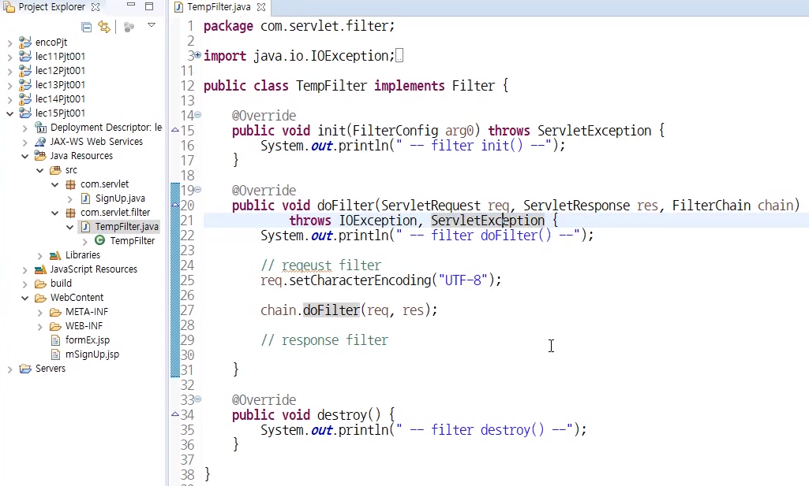
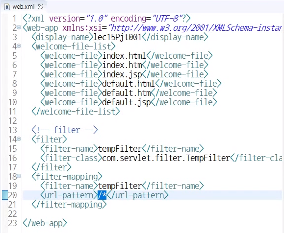

JSP 한글이 깨지는 현상 해결하는 방법 
방식에 따라서 방법이 다르다
 

### 1) post
post 방식의 경우 서블릿마다  request.setCharacterEncoding(“UTF-8”); 추가한다.

### 2) get
get방식의 경우 server.xml에 <Connector URIEncoding=”UTF-8” />추가한다.

### 3) filter 이용
post 방식에서 모든 servlet에 request.setCharacterEncoding(“UTF-8”); 을 추가하는 것은 좋지 않은 코딩방식이다. 
따라서 filter를 사용한다!(chain 기법)

1. 필터 파일 생성

2. web.xml 설정 추가

 
 
출처: 인프런 "실전 JSP" / 