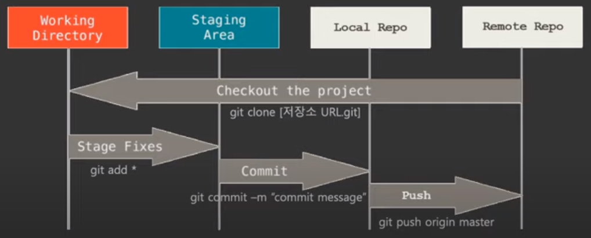

단군소프트에서는 4주마다 GitHub 교육을 진행하는데 이번 강의의 주제는 <b>Command Line Interface</b><br />
 사용법이었다.
<br />

CLI의 장점
---
<hr />
- Git 의 모든 기능은 커맨드로만 사용이 가능
- GUI 만 사용할 경우 활용에 한계가 있을 수 있음
- GUI 에서 어떤 액션이 어떤 커맨드를 이용하여 실행되는지 알아야 문제가 발생할 경우 좀 더 빠른 해결이 가능

Git 저장소 구조
---
<hr />

<b>Remote Repo</b>는 Github에 만든 저장소<br />
<b>Working Directory, Staging Area, Local Repo</b> 는 작업자의 PC

<br />

자주 사용하는 Git Command
---
<hr />

### - git init
- git으로 관리할 디렉토리에서 실행하면 .git 디렉토리가 생성

### - git add
- git 저장소의 디렉토리에 추가된 파일을 추적 및 버전관리를 위해 실행

```
- git add [file_name]: 특정 파일만 관리하도록 설정
- git add *.[확장자]: 특정 확장자 파일만 관리하도록 설정
- git add . : 추가된 모든 파일을 관리하도록 설정
```

### - git status
- 저장소의 현재 상태를 확인하기 위해 실행

### - git diff
- 마지막 커밋과 staging area의 차이를 확인할 때 사용

### - git reset
- git add로 staging area로 올린 파일을 다시 working directory로 되돌릴 때 사용

```
- git reset HEAD [file_name]: 특정 파일을 working directory로 되돌릴 때 사용
- git reset: staging area에 있는 파일들을 모두 working directory로 되돌릴 때 사용
```
- 해당 커맨드를 실행하기 전에 git status를 실행하여 정상적으로 실행이 되었는지 확인 필요

### - git commit
- 저장소의 변경된 항목을 Local 저장소로 저장할 때 사용하며, 변경된 파일은 HEAD에 저장

```
- git commit -m "commit message" : staging area에 있는 내용을 Local 저장소에 저장
- git commit -am "commit message" : working directory에 추가된 항목을 git add를 
포함하여 커밋
```

### - git branch

```
- git branch: 현재 모든 브랜치를 출력
- git branch [branch_name]: branch_name으로 신규 브랜치 생성
- git checkout [branch_name]: branch_name으로 브랜치 이동
- git checkout -b [branch_name]: branch_name의 신규브랜치 생성 후 해당 브랜치로 이동
- git branch -d [branch_name]: branch_name의 브랜치 삭제
```

### - git merge

```
- git merge [branch_name]: branch_name 브랜치를 현재 브랜치로 병합
- git merge --squash [branch_name]: branch_name 브랜치의 여러 커밋을 하나의 커밋으로 병합
- git cherry-pick [commit_ID]: 특정 커밋만 병합
```

### - git rm

```
- git rm --cached [file_name]: staging area에 있는 특정 파일을 추적하지 않도록 설정
(제거가 아님)
```

### - git log
- 커밋 이력 상세 조회

```
- git log --oneline: 커밋 이력 중 커밋 ID, 커밋 타이틀만 조회
- git log --oneline --decorate --graph --all: 모든 브랜치의 커밋 이력 조회
- git log --[file_name]: 특정 파일의 커밋 내역만 조회
```


<br />
<br />
출처: 단군소프트 "GitHub Webinar - CLI 사용법"