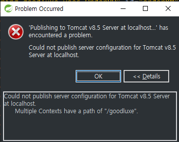
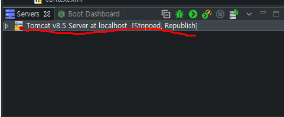
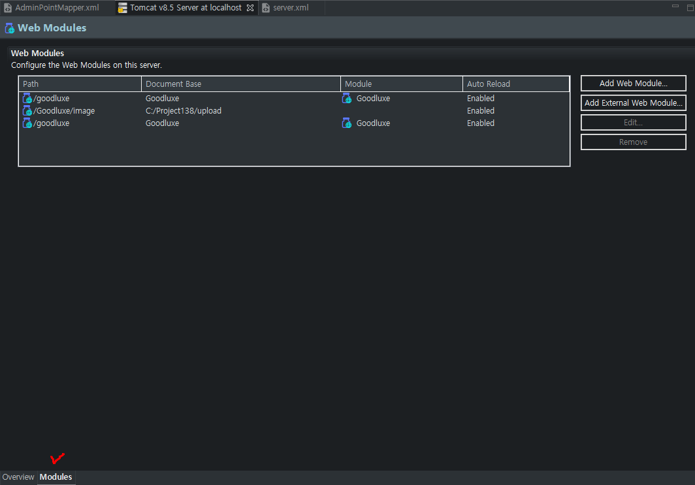
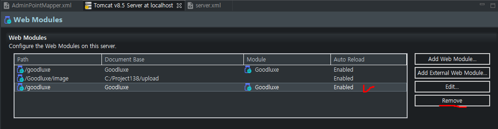

학원에서 진행했던 프로젝트를 다른 폴더로 복사해서 서버구동을 하려니 아래와 같은 에러가 발생했다.

 

 
"Multiple Contexts have a path of "/goodluxe"." 
"/goodluxe" 라는 경로를 서버에서 중복해서 사용해서 발생한 에러인거 같았다. 
 

 
Servers탭에 Tomcat을 더블클릭해준다. 

 
우측 하단에 Modules 탭을 클릭한다.

 
/goodluxe 경로가 두개 생성돼있는 것을 볼 수 있다.  
하나만 삭제해도 된다고하는데 그렇게 하면 다시 경로가 생성되어 또 같은 오류가 발생하여 
그냥 /goodluxe라고 돼있는 부분 각각 선택해서 Remove를 해준다. 
 
그리고 저장하고 서버구동을 하면 잘 구동하는 것을 볼 수 있다 :)