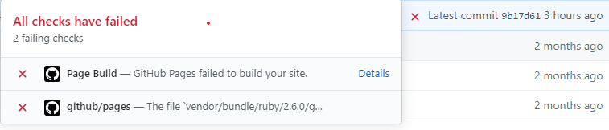

github와 jekyll을 이용해 블로그를 운영하고 있었는데 어느 순간부터 아래와 같은 에러가 발생했다.<br />


<br />

```
Document 'vendor/cache/gems/jekyll-3.2.1/lib/site_template/_posts/0000-00-00-welcome-to-jekyll.markdown.erb' does not have a valid date in the YAML front matter.
```
깃허브에서 커밋을 실패하여 로컬서버에서는 변경사항이 반영됐지만 실제 온라인상에서는 반영이 되지 않았다.<br />
방법을 몰라서 블로그를 밀고 다시 지킬을 설치하고를 수차례 반복했었는데 드디어 해결책을 찾았다.<br />
<br />
방법은 상당히 간단했다.
<br />
<br />
_config.yml 파일에

```yml
exclude: [vendor]
```
을 추가해주고 다시 커밋을 하면 된다.<br />
이렇게 간단히 해결되다니 허무하다ㅠㅠ

<br />