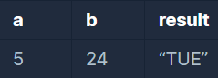

```
-문제설명
2016년 1월 1일은 금요일입니다. 2016년 a월 b일은 무슨 요일일까요? 
두 수 a ,b를 입력받아 2016년 a월 b일이 무슨 요일인지 리턴하는 함수, solution을 완성하세요. 
요일의 이름은 일요일부터 토요일까지 각각 SUN,MON,TUE,WED,THU,FRI,SAT 입니다.
예를 들어 a=5, b=24라면 5월 24일은 화요일이므로 문자열 TUE를 반환하세요.

-제한 조건
2016년은 윤년입니다.
2016년 a월 b일은 실제로 있는 날입니다. (13월 26일이나 2월 45일같은 날짜는 주어지지 않습니다)
```
<b>입출력 예</b>

<br />

내가 쓴 정답은 아래와 같다.
```java
class Solution {
    public String solution(int a, int b) {
        String answer = "";
        
        int dayOfMonth = 0;
        int totalDay = 0;
        
        for(int i=1; i<a; i++){
            if(i==1 || i==3 || i==5 || i==7 || i==8 || i==10 || i==12)
                dayOfMonth = 31;
            else if(i==2)
                dayOfMonth = 29;
            else
                dayOfMonth = 30;
            
            totalDay += dayOfMonth;
        }
        
        totalDay += b;
        
        switch(totalDay % 7){
            case 0:
                answer = "THU";
                break;
            case 1:
                answer = "FRI";
                break;
            case 2:
                answer = "SAT";
                break;
            case 3:
                answer = "SUN";
                break;
            case 4:
                answer = "MON";
                break;
            case 5:
                answer = "TUE";
                break;
            case 6:
                answer = "WED";
                break;    
        }
        return answer;
    }
}
```

