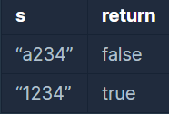

```
-문제설명
문자열 s의 길이가 4 혹은 6이고, 숫자로만 구성돼있는지 확인해주는 함수, 
solution을 완성하세요. 
예를 들어 s가 a234이면 False를 리턴하고 1234라면 True를 리턴하면 됩니다.

-제한 조건
s는 길이 1 이상, 길이 8 이하인 문자열입니다.
```
<b>입출력 예</b>

<br />

char 타입의 속성만 이해하고 있으면<br>
쉽게 풀 수 있는 문제였다.
```java
class Solution {
    public boolean solution(String s) {
        boolean answer = true;
        
        char[] ch = s.toCharArray();
        
        if(ch.length != 4 && ch.length != 6){
            return false;
        }
        
        for(int i=0; i<ch.length; i++){
            if(!(ch[i] >= '0' && ch[i] <='9')){
                return false;
            }
        }
        
        return answer;
    }
}
```

