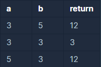

```
-문제설명
두 정수 a, b가 주어졌을 때 a와 b 사이에 속한 
모든 정수의 합을 리턴하는 함수, solution을 완성하세요.
예를 들어 a = 3, b = 5인 경우, 
3 + 4 + 5 = 12이므로 12를 리턴합니다.

-제한 조건
a와 b가 같은 경우는 둘 중 아무 수나 리턴하세요.
a와 b는 -10,000,000 이상 10,000,000 이하인 정수입니다.
a와 b의 대소관계는 정해져있지 않습니다.
```
<b>입출력 예</b>

<br />

사이값만큼 for문으로 돌리면 되는 간단 문제였다.
```java
class Solution {
    public long solution(int a, int b) {
        long answer = 0;
        
        int temp = 0;
        
        if(a>b){
            temp = a;
            a = b;
            b = temp;
        }
        
        for(int i=a; i<=b; i++){
            answer += i;
        }
        
        return answer;
    }
}
```

