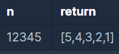

```
-문제설명
자연수 n을 뒤집어 각 자리 숫자를 원소로 가지는 배열 형태로 리턴해주세요. 
예를들어 n이 12345이면 [5,4,3,2,1]을 리턴합니다.

-제한 조건
n은 10,000,000,000이하인 자연수입니다.
```
<b>입출력 예</b>

<br />

toCharArray와 for문을 이용하면 되는 문제이다.
```java
class Solution {
    public int[] solution(long n) {
        
        String tempStr = new String(n+"");
        char[] tempChar = tempStr.toCharArray();
        int[] answer = new int[tempChar.length];
        for(int i=0; i<tempChar.length; i++){
            answer[i] = Integer.parseInt(tempChar[tempChar.length-1-i]+"");
        }
        return answer;
    }
}
```

