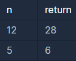

```
-문제설명
정수 n을 입력받아 n의 약수를 모두 더한 값을 리턴하는 함수, solution을 완성해주세요.

-제한 조건
n은 0 이상 3000이하인 정수입니다.
```
<b>입출력 예</b>

<br />

```
입출력 예 #1
12의 약수는 1, 2, 3, 4, 6, 12입니다. 이를 모두 더하면 28입니다.

입출력 예 #2
5의 약수는 1, 5입니다. 이를 모두 더하면 6입니다.
```

나눴을 때 나머지가 0이 되는 것이 약수 이므로
for문을 이용해서 간단하게 풀 수 있는 문제이다.
```java
import java.util.*;

class Solution {
    public int solution(int n) {
        
        int answer = 0;
        
        for(int i=1; i<=n; i++){
            if(n%i==0){
                answer += i;
            }
        }
        
        return answer;
    }
}
```

