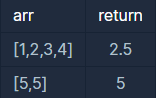

```
-문제설명
정수를 담고 있는 배열 arr의 평균값을 return하는 함수, solution을 완성해보세요.

-제한 조건
arr은 길이 1 이상, 100 이하인 배열입니다.
arr의 원소는 -10,000 이상 10,000 이하인 정수입니다.
```
<b>입출력 예</b>

<br />

처음에는 int cnt를 따로 선언해서 횟수를 카운트했는데 생각해보니
배열의 길이로 구하면 됐다. 그리고 꼭 강제형변환을 해줘야함!
```java
class Solution {
    public double solution(int[] arr) {
        
        int sum =0;
        
        for(int i=0; i<arr.length; i++){
            sum += arr[i];
        }
        
        double answer = (double)sum/arr.length;
        return answer;
    }
}
```

