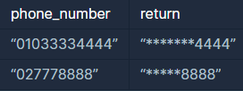

```
-문제설명
프로그래머스 모바일은 개인정보 보호를 위해 고지서를 보낼 때 
고객들의 전화번호의 일부를 가립니다.
전화번호가 문자열 phone_number로 주어졌을 때, 
전화번호의 뒷 4자리를 제외한 나머지 숫자를 
전부 *으로 가린 문자열을 리턴하는 함수, solution을 완성해주세요.

-제한 조건
s는 길이 4 이상, 20이하인 문자열입니다.
```
<b>입출력 예</b>

<br />

전화번호의 길이를 구해서 뒷자리 4자리를 뺀 만큼
for문을 돌려서 *로 처리해주고 마지막에 4자리를
붙여주는 방법으로 풀어보았다.
```java
class Solution {
    public String solution(String phone_number) {
        int num_length = phone_number.length();
        String tmp = phone_number(num_length-4,num_length);
        String star = "";
        
        for(int i=0; i<num_length-4; i++){
            star += "*";
        }
        
        String answer = star + tmp;
        return answer;
    }
}
```

