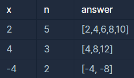
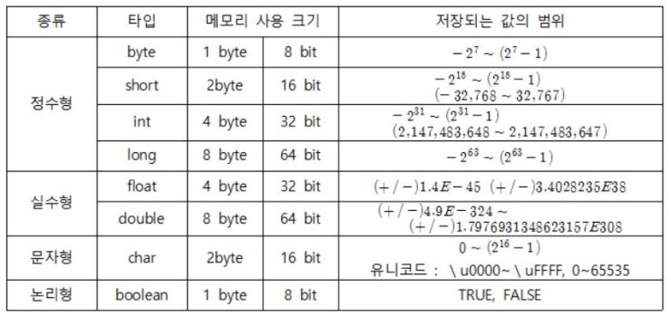

```
-문제설명
함수 solution은 정수 x와 자연수 n을 입력 받아, 
x부터 시작해 x씩 증가하는 숫자를 n개 지니는 리스트를 리턴해야 합니다. 
다음 제한 조건을 보고, 조건을 만족하는 함수, solution을 완성해주세요.

-제한 조건
x는 -10000000 이상, 10000000 이하인 정수입니다.
n은 1000 이하인 자연수입니다.
```
<b>입출력 예</b>

<br />

처음에 이렇게 풀었는데 정확성이 85.7로 실패했다.
```java
class Solution {
    public long[] solution(int x, int n) {
        long[] answer = new long[n];
        for(int i=0; i<n; i++){
            answer[i] = x * (i+1);
        }
        
        return answer;
    }
}
```

<br />

int x 를 long 타입으로 바꿨더니 정확성 100이 됐다.<br />
int의 범위를 넘어 갈 수 있는 부분을 long타입으로 바꿔야 했다.<br />


```java
class Solution {
    public long[] solution(int x, int n) {
        long[] answer = new long[n];
        long tmp = x;
        
        for(int i=0; i<n; i++){
            answer[i] = tmp * (i+1);
        }
        return answer;
    }
}
```

