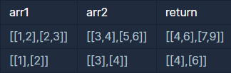
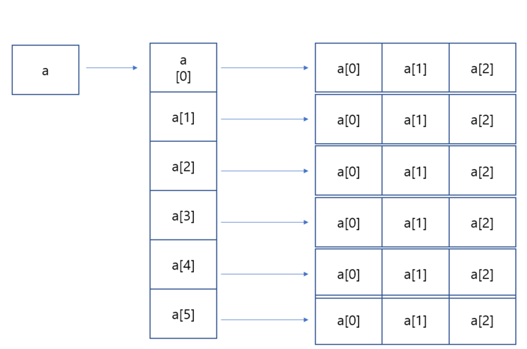

```
-문제설명
행렬의 덧셈은 행과 열의 크기가 같은 두 행렬의 같은 행, 
같은 열의 값을 서로 더한 결과가 됩니다. 2개의 행렬 arr1과 arr2를 입력받아, 
행렬 덧셈의 결과를 반환하는 함수, solution을 완성해주세요.

-제한 조건
행렬 arr1, arr2의 행과 열의 길이는 500을 넘지 않습니다.
```
<b>입출력 예</b>

<br />

2차원 배열에 대한 내용이라 length에 대한 내용이 헷갈렸다.

<br />
<b>참고자료</b>

a.length 즉  a 배열의 첫번재 배열길이는 5이고<br />
a[0].length 의 배열길이는 3이다.<br /><br />

이 내용을 참고로 for문을 이용해 푸니 쉽게 풀 수 있었다.

```java
class Solution {
    public int[][] solution(int[][] arr1, int[][] arr2) {
        int[][] answer = new int[arr1.length][arr1[0].length];
        for(int i=0; i<arr1.length; i++){
            for(int j=0; j<arr1[i].length; j++){
                answer[i][j] = arr1[i][j] + arr2[i][j]; 
            }
        }
        
        return answer;
    }
}
```