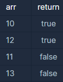

```
-문제설명
양의 정수 x가 하샤드 수이려면 x의 자릿수의 합으로 x가 나누어져야 합니다. 
예를 들어 18의 자릿수 합은 1+8=9이고, 18은 9로 나누어 떨어지므로 18은 하샤드 수입니다. 
자연수 x를 입력받아 x가 하샤드 수인지 아닌지 검사하는 함수, solution을 완성해주세요.

-제한 조건
x는 1 이상, 10000 이하인 정수입니다.
```
<b>입출력 예</b>

<br />

실행 시간이 10초를 초과하여 실행이 중지됐다.<br />
```java
class Solution {
    public boolean solution(int x) {
        int sum = 0;
        int num = 0;
        boolean answer = true;
        
        while(x != 0){
            sum += (x % 10);
            num /= 10;
            //num을 10으로 나눈 값을 다시 num에 저장한다.
        }
        
        if(x%sum == 0){
            answer = true;
        }else{
            answer = false;
        }
        
        return answer;
    }
}
```
<br />
입력받는 x값을 num에 다시 넣어서 실행하니 잘됐다.<br />

```java
class Solution {
    public boolean solution(int x){
        int sum = 0;
        int num = x;
        boolean answer = true;
        
        while(num != 0){
            sum += (num % 10);
            num /= 10;
            //num을 10으로 나눈 값을 다시 num에 저장한다.
        }
        
        if(x%sum == 0){
            answer = true;
        }else{
            answer = false;
        }
        
        return answer;
    }
}
```