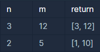

```
-문제설명
두 수를 입력받아 두 수의 최대공약수와 최소공배수를 반환하는 함수, 
solution을 완성해 보세요. 배열의 맨 앞에 최대공약수, 
그다음 최소공배수를 넣어 반환하면 됩니다. 
예를 들어 두 수 3, 12의 최대공약수는 3, 최소공배수는 12이므로 
solution(3, 12)는 [3, 12]를 반환해야 합니다.

-제한 사항
두 수는 1이상 1000000이하의 자연수입니다.
```
<b>입출력 예</b>

<br />

최소공배수 구하는 공식을 잘 몰라서 애를 먹었다.<br />
answer[1] = (min*max); -> answer[1] = (min*max)/answer[0];<br />
이렇게 바꾸니 실행됨

```java
class Solution {
    public int[] solution(int n, int m) {
        int max = 0;
        int min = 0;
        int[] answer = new int[2];
        
        // 정렬
        if(m>n){
            max = m;
            min = n;
        }else{
            max = n;
            min = m;
        }
        
        // 최대공약수
        for(int i=1; i<=max; i++){
            if(min % i == 0 && max % i == 0){
                answer[0] = i;
            }
        }
        
        // 최소공배수
        if(max % min == 0){
            answer[1] = max;
        }else{
            answer[1] = (min*max)/answer[0];
        }

        return answer;
    }
}
```
<br />
int num을 long num으로 바꾸니 실행됐다. 왜지?<br />

```java
class Solution {
    public int solution(long num) {
        int answer = 0;
        
        while(num != 1){
            if(num % 2 == 0){
                num = num / 2;
            }else{
                num = (num*3)+1;
            }
            answer++;
            
            if(answer == 500){
                answer = -1;
                break;
            }
        }
        return answer;
    }
}
```