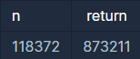

```
-문제설명
함수 solution은 정수 n을 매개변수로 입력받습니다. 
n의 각 자릿수를 큰것부터 작은 순으로 정렬한 새로운 정수를 리턴해주세요. 
예를들어 n이 118372면 873211을 리턴하면 됩니다.

-제한 사항
n은 1이상 8000000000 이하인 자연수입니다.
```
<b>입출력 예</b>

<br />

일단 n의 길이를 구하고 배열에 넣고<br />
내림차순으로 정열하는 reverseOrder를 이용했다.<br />
근데 왜 오류가 나지ㅠㅠ<br />

```java
import.java.util.Arrays;
import.java.util.Collections;

class Solution {
    public long solution(long n) {
        long answer = 0;
        
        // n의 길이를 구한다
        int length = Long.toString(n).split("").length;
        String[] arr = new String[length];
        
        // 하나씩 배열에 넣어줌
        arr = Long.toString(n).split("");
        
        // 내림차순 정렬
        Arrays.sort(arr,Collections.reverseOrder());
        
        String tmp = "";
        for(int i=0; i<length; i++){
            tmp += (long)Integer.parseInt(array[i]);
        }
        
        answer = Long.parseLong(tmp);
        return answer;
    }
}
```