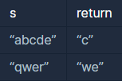

```
-문제설명
단어 s의 가운데 글자를 반환하는 함수, solution을 만들어 보세요. 
단어의 길이가 짝수라면 가운데 두글자를 반환하면 됩니다.

-제한사항
s는 길이가 1 이상, 100이하인 스트링입니다.
```
<b>입출력 예</b>

<br />


```
- 이용한 개념
String.length(); // 문자열길이

Math.ceil(); // 올림
Math.round(); // 반올림
Math.floor(); // 내림
Math.abs(); // 절대값

String.substring(start) //start위치부터 끝까지 문자열 자르기
String.substring(start,end) //start위치 부터 end전까지 문자열 발췌

String str = "ABCDEFG"; //대상 문자열
/*A=0 B=1 C=2 D=3 E=4 F=5 G=6의 index를 가진다.*/
```

```java
class Solution {
    public String solution(String s) {
        // s 길이
        int len = s.length();
        int num = 0;
        String answer = "";
        
        if(len % 2 == 0){
            num = len/2;
            answer = s.substring(num-1,num+1);
        }else{
            num = (int)Math.ceil(len/2);
            answer = s.substring(num,num+1);
        }
        
        return answer;
    }
}
```