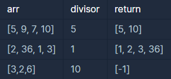

```
-문제설명
array의 각 element 중 divisor로 나누어 떨어지는 값을 
오름차순으로 정렬한 배열을 반환하는 함수, solution을 작성해주세요.
divisor로 나누어 떨어지는 element가 하나도 없다면 
배열에 -1을 담아 반환하세요.

-제한사항
arr은 자연수를 담은 배열입니다.
정수 i, j에 대해 i ≠ j 이면 arr[i] ≠ arr[j] 입니다.
divisor는 자연수입니다.
array는 길이 1 이상인 배열입니다.
```
<b>입출력 예</b>

<br />

```
입출력 예#1
arr의 원소 중 5로 나누어 떨어지는 원소는 5와 10입니다. 
따라서 [5, 10]을 리턴합니다.

입출력 예#2
arr의 모든 원소는 1으로 나누어 떨어집니다. 
원소를 오름차순으로 정렬해 [1, 2, 3, 36]을 리턴합니다.

입출력 예#3
3, 2, 6은 10으로 나누어 떨어지지 않습니다. 
나누어 떨어지는 원소가 없으므로 [-1]을 리턴합니다.
```

처음에 배열을 이용하려고 했으나<br />
java.lang.ArrayIndexOutOfBoundsException 떠서 실패<br />
```java
//import java.util.Arrays;

class Solution {
    public int[] solution(int[] arr, int divisor) {
        int[] answer = {};
        
        //Arrays.sort(arr);
        
        for(int i=0; i<arr.length; i++){
            if(arr[i]%divisor == 0){
                answer[i] = arr[i];
            }
        }
        
        if(answer.length == 0){
            answer[0] = -1;
        }
        
        return answer;
    }
}
```

arrayList를 이용해서 다시 풀이 시작했는데<br />
정확도 30점대로 실패했다.
```java
import java.util.*;

class Solution {
    public int[] solution(int[] arr, int divisor) {
        
        ArrayList<Integer> list = new ArrayList<Integer>();
        
        int[] answer = {};

        for(int i=0; i<arr.length; i++){
            if(arr[i]%divisor == 0){
                list.add(arr[i]);
            }else if(list.isEmpty()){
                list.add(-1);
            }
        }
        
        answer = new int[list.size()];
            for(int i=0; i<list.size(); i++){
                answer[i] = list.get(i);
            }
        
        Arrays.sort(answer);
        
        return answer;
    }
}
```
다시보니 if문이 else if로 돼있고 for문 안에 들어가 있어서<br />
for문 밖으로 빼고 if문으로 바꿔줬더니 실행됐다.


```
- 이용한 개념
list.isEmpty() // list.size()==0; 과 같은 개념
Arrays.sort(arr); // 배열을 오름차순으로 정렬
```

```java
import java.util.*;

class Solution {
    public int[] solution(int[] arr, int divisor) {
        
        ArrayList<Integer> list = new ArrayList<Integer>();
        
        int[] answer = {};

        for(int i=0; i<arr.length; i++){
            if(arr[i]%divisor == 0){
                list.add(arr[i]);
            }
        }
        
        if(list.isEmpty()){
            list.add(-1);
        }
        
        answer = new int[list.size()];
            for(int i=0; i<list.size(); i++){
                answer[i] = list.get(i);
            }
        
        Arrays.sort(answer);
        
        return answer;
    }
}
```