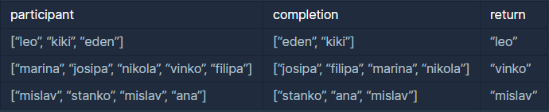

```
-문제설명
수많은 마라톤 선수들이 마라톤에 참여하였습니다. 
단 한 명의 선수를 제외하고는 모든 선수가 마라톤을 완주하였습니다.

마라톤에 참여한 선수들의 이름이 담긴 배열 participant와 
완주한 선수들의 이름이 담긴 배열 completion이 주어질 때, 
완주하지 못한 선수의 이름을 return 하도록 solution 함수를 작성해주세요.

-제한사항
마라톤 경기에 참여한 선수의 수는 1명 이상 100,000명 이하입니다.
completion의 길이는 participant의 길이보다 1 작습니다.
참가자의 이름은 1개 이상 20개 이하의 알파벳 소문자로 이루어져 있습니다.
참가자 중에는 동명이인이 있을 수 있습니다.
```
<b>입출력 예</b>

<br />

```
-입출력 예 설명
예제 #1
leo는 참여자 명단에는 있지만, 
완주자 명단에는 없기 때문에 완주하지 못했습니다.

예제 #2
vinko는 참여자 명단에는 있지만, 
완주자 명단에는 없기 때문에 완주하지 못했습니다.

예제 #3
mislav는 참여자 명단에는 두 명이 있지만, 
완주자 명단에는 한 명밖에 없기 때문에 한명은 완주하지 못했습니다.
```
<br />

일단 오름차순으로 정렬해서<br />
participant와 completion가 같지 않을 때 완주명단에 없는걸로 풀었다<br />

```java
import java.util.Arrays;

class Solution {
    public String solution(String[] participant, String[] completion) {
        String answer = "";
        
        // 오름차순으로 정렬
        Arrays.sort(participant);
        Arrays.sort(completion);
        
        for(int i=0; i<completion.length; i++){
            if(!participant[i].equals(completion[i])){
                answer = participant[i];
                return answer;
            }
        }
        answer = participant[participant.length-1];
        return answer;
    }
}
```

### 다른사람 문제풀이
```java
import java.util.HashMap;

class Solution {
    public String solution(String[] participant, String[] completion) {
        String answer = "";
        HashMap<String, Integer> hm = new HashMap<>();
        for (String player : participant) hm.put(player, hm.getOrDefault(player, 0) + 1);
        for (String player : completion) hm.put(player, hm.get(player) - 1);

        for (String key : hm.keySet()) {
            if (hm.get(key) != 0){
                answer = key;
            }
        }
        return answer;
    }
}
```