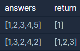

```
-문제설명
수포자는 수학을 포기한 사람의 준말입니다. 
수포자 삼인방은 모의고사에 수학 문제를 전부 찍으려 합니다. 
수포자는 1번 문제부터 마지막 문제까지 다음과 같이 찍습니다.

1번 수포자가 찍는 방식: 1, 2, 3, 4, 5, 1, 2, 3, 4, 5, ...
2번 수포자가 찍는 방식: 2, 1, 2, 3, 2, 4, 2, 5, 2, 1, 2, 3, 2, 4, 2, 5, ...
3번 수포자가 찍는 방식: 3, 3, 1, 1, 2, 2, 4, 4, 5, 5, 3, 3, 1, 1, 2, 2, 4, 4, 5, 5, ...

1번 문제부터 마지막 문제까지의 정답이 순서대로 들은 배열 answers가 주어졌을 때, 
가장 많은 문제를 맞힌 사람이 누구인지 배열에 담아 return 하도록 solution 함수를 작성해주세요.

-제한사항
시험은 최대 10,000 문제로 구성되어있습니다.
문제의 정답은 1, 2, 3, 4, 5중 하나입니다.
가장 높은 점수를 받은 사람이 여럿일 경우, return하는 값을 오름차순 정렬해주세요.
```
<b>입출력 예</b>

<br />

```
-입출력 예 설명
입출력 예 #1

수포자 1은 모든 문제를 맞혔습니다.
수포자 2는 모든 문제를 틀렸습니다.
수포자 3은 모든 문제를 틀렸습니다.
따라서 가장 문제를 많이 맞힌 사람은 수포자 1입니다.

입출력 예 #2

모든 사람이 2문제씩을 맞췄습니다.
```
<br />

학생수가 정해져있어서 조금 수월했던 문제인거 같다.<br />
max 구하는 부분에서 조금 막혔었는데 Math를 잘 이용하도록 연습해야겠다.<br />


```java
import java.util.ArrayList;

class Solution {
    public int[] solution(int[] answers) {
        int[] answer1 = {1, 2, 3, 4, 5};
        int[] answer2 = {2, 1, 2, 3, 2, 4, 2, 5};
        int[] answer3 = {3, 3, 1, 1, 2, 2, 4, 4, 5, 5};
        int cnt1 = 0;
        int cnt2 = 0;
        int cnt3 = 0;
        // 12345 반복
        // 21232425 8개
        // 33 11 22 44 55   31245 이순으로 반복
        
        for(int i=0; i<answers.length; i++){
            if(answers[i] == answer1[i%answer1.length]){
                cnt1++;
            }
            if(answers[i] == answer2[i%answer2.length]){
                cnt2++;
            }
            if(answers[i] == answer3[i%answer3.length]){
                cnt3++;
            }
        }
        
        // max 구하기
        int max = Math.max(Math.max(cnt1, cnt2),cnt3);
        ArrayList<Integer> list = new ArrayList<Integer>();
        
        if(max == cnt1){
            list.add(1);
        }
        if(max == cnt2){
            list.add(2);
        }
        if(max == cnt3){
            list.add(3);
        }
        
        int[] answer = new int[list.size()];
        
        for(int i=0; i<answer.length; i++){
            answer[i] = list.get(i);
        }
        
        return answer;
    }
}
```