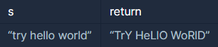

```
-문제설명
문자열 s는 한 개 이상의 단어로 구성되어 있습니다. 
각 단어는 하나 이상의 공백문자로 구분되어 있습니다. 
각 단어의 짝수번째 알파벳은 대문자로, 
홀수번째 알파벳은 소문자로 바꾼 문자열을 리턴하는 함수, 
solution을 완성하세요.

-제한사항
문자열 전체의 짝/홀수 인덱스가 아니라, 
단어(공백을 기준)별로 짝/홀수 인덱스를 판단해야합니다.
첫 번째 글자는 0번째 인덱스로 보아 짝수번째 알파벳으로 처리해야 합니다.
```
<b>입출력 예</b>

<br />

```
-입출력 예 설명
try hello world는 세 단어 try, hello, world로 구성되어 있습니다. 
각 단어의 짝수번째 문자를 대문자로, 홀수번째 문자를 소문자로 바꾸면 TrY, HeLlO, WoRlD입니다. 
따라서 TrY HeLlO WoRlD 를 리턴합니다.
```
<br />

split(" ")으로 처리했을때 68점이 나와서 애먹었는데<br />
split(" ",-1)으로 바꾸니 100점이 나왔다. 무슨 차이일까?<br />
```
- String[] split(String regex) : 인자로 주어진 정규식과 매치되는 문자열을 구분자로 분할합니다.
- String[] split(String regex, int limit) : 인자로 주어진 정규식과 매치되는 문자열을 구분자로 분할 합니다.
두 번째 인자로 정규식을 적용하는 횟수를 제한할 수 있습니다.

- limit가 음수인 경우 : 찾는 패턴이 가능한한 최대로 적용되고 마지막 요소가 빈문자열일 경우 포함됩니다.
- limit가 0인 경우 : 찾는패턴이 가능한한 최대로 적용되고 마지막 요소가 빈문자열일 경우 버려집니다
(이것이 두 번째 인자가 없을때 동작입니다).
- limit가 양수인 경우 : 찾는 패턴이 limit - 1회 적용됩니다. 배열의 길이는 limit보다 크지 않으며, 
적용하고 남은 나머지 문자열 전체가 마지막 요소가 됩니다.

출처: https://offbyone.tistory.com/398 [쉬고 싶은 개발자]
```

```java
class Solution {
    public String solution(String s) {
        String answer = "";
        
        // 공백기준으로 문자열 자르기
        String str[] = s.split(" ",-1);
        
        // 소문자 97~122, 대문자 65~90 32만큼 차이
        for(int i=0; i<str.length-1; i++){
            for(int j=0; j<=str[i].length()-1; j++){
                // 홀수번째는 소문자
                if(j%2==1){                
                    int tmp = (int)str[i].charAt(j);
                    if(tmp>=65 && tmp<=90){
                        answer += (char)(tmp + 32);
                    }else{
                        answer += (char)tmp;
                    }
                }

                // 짝수번째는 대문자
                if(j%2==0){                
                    int tmp = (int)str[i].charAt(j);
                    if(tmp>=97 && tmp<=122){
                        answer += (char)(tmp - 32);
                    }else{
                        answer += (char)tmp;
                    }
                }
            }
            answer += " ";
        }
        
        // 마지막 공백 없애기 위해서
        for(int j=0; j<=str[str.length-1].length()-1; j++){
                // 홀수번째는 소문자
                if(j%2==1){                
                    int tmp = (int)str[str.length-1].charAt(j);
                    if(tmp>=65 && tmp<=90){
                        answer += (char)(tmp + 32);
                    }else{
                        answer += (char)tmp;
                    }
                }

                // 짝수번째는 대문자
                if(j%2==0){                
                    int tmp = (int)str[str.length-1].charAt(j);
                    if(tmp>=97 && tmp<=122){
                        answer += (char)(tmp - 32);
                    }else{
                        answer += (char)tmp;
                    }
                }
            }
        
        return answer;
    }
}
```