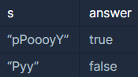

```
-문제설명
대문자와 소문자가 섞여있는 문자열 s가 주어집니다. 
s에 'p'의 개수와 'y'의 개수를 비교해 같으면 True, 
다르면 False를 return 하는 solution를 완성하세요. 
'p', 'y' 모두 하나도 없는 경우는 항상 True를 리턴합니다. 
단, 개수를 비교할 때 대문자와 소문자는 구별하지 않습니다.

예를 들어 s가 pPoooyY면 true를 return하고 Pyy라면 false를 return합니다.

-제한사항
문자열 s의 길이 : 50 이하의 자연수
문자열 s는 알파벳으로만 이루어져 있습니다.
```
<b>입출력 예</b>

<br />

```
-입출력 예 설명
입출력 예 #1
'p'의 개수 2개, 'y'의 개수 2개로 같으므로 true를 return 합니다.

입출력 예 #2
'p'의 개수 1개, 'y'의 개수 2개로 다르므로 false를 return 합니다.
```
<br />

charAt를 이용해서 간단하게 풀 수 있는 문제였다.<br />

```java
class Solution {
    boolean solution(String s) {
        boolean answer = true;

        int cntP = 0;
        int cntY = 0;
        
        for(int i=0; i<s.length(); i++){
            char tmp = s.charAt(i);
            if('p' == tmp || 'P' == tmp){
                cntP++;
            }
            if('y' == tmp || 'Y' == tmp){
                cntY++;
            }
        }
        
        if(cntP != cntY){
            answer = false;
        }

        return answer;
    }
}
```
<br />

### 다른 사람 풀이
처음부터 다 소문자로 만들고<br />
count 변수만 하나로 가져가는 것이 더 간결해보였다.
```java
class Solution {
    boolean solution(String s) {
        s = s.toLowerCase();
        int count = 0;

        for (int i = 0; i < s.length(); i++) {

            if (s.charAt(i) == 'p')
                count++;
            else if (s.charAt(i) == 'y')
                count--;
        }

        if (count == 0)
            return true;
        else
            return false;
    }
}
```