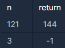

```
-문제설명
임의의 양의 정수 n에 대해, 
n이 어떤 양의 정수 x의 제곱인지 아닌지 판단하려 합니다.
n이 양의 정수 x의 제곱이라면 x+1의 제곱을 리턴하고, 
n이 양의 정수 x의 제곱이 아니라면 -1을 리턴하는 함수를 완성하세요.

-제한사항
n은 1이상, 50000000000000 이하인 양의 정수입니다.
```
<b>입출력 예</b>

<br />

```
-입출력 예 설명
입출력 예#1
121은 양의 정수 11의 제곱이므로, (11+1)를 제곱한 144를 리턴합니다.

입출력 예#2
3은 양의 정수의 제곱이 아니므로, -1을 리턴합니다.
```
<br />

푸는중<br />

```java
class Solution {
    public int solution(int n, int[] lost, int[] reserve) {
        int answer = 0;
        return answer;
    }
}
```