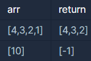

```
-문제설명
정수를 저장한 배열, arr 에서 가장 작은 수를 제거한 배열을 리턴하는 함수, 
solution을 완성해주세요. 
단, 리턴하려는 배열이 빈 배열인 경우엔 배열에 -1을 채워 리턴하세요. 
예를들어 arr이 [4,3,2,1]인 경우는 [4,3,2]를 리턴 하고, [10]면 [-1]을 리턴 합니다.

-제한사항
arr은 길이 1 이상인 배열입니다.
인덱스 i, j에 대해 i ≠ j이면 arr[i] ≠ arr[j] 입니다.
```
<b>입출력 예</b>

<br />

<br />

처음에는 문제가 낮은 수가 제일 마지막에 나오는게 고정인줄 알고<br />
배열 마지막을 안넣는 방식으로 했는데 실패했다.<br />

```java
class Solution {
    public int[] solution(int[] arr) {
        if(arr.length == 1){
            int[] answer = new int[1];
            answer[0] = -1;
            return answer;
        }else{
            int[] answer = new int[arr.length-1];
            for(int i=0; i<arr.length-1; i++){
            answer[i] = arr[i];
            }
            return answer;
        }
    }
}
```
<br />
<br />