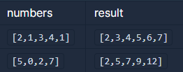

```
-문제설명
정수 배열 numbers가 주어집니다. 
numbers에서 서로 다른 인덱스에 있는 두 개의 수를 뽑아 더해서 만들 수 있는 
모든 수를 배열에 오름차순으로 담아 return 하도록 solution 함수를 완성해주세요.

-제한사항
numbers의 길이는 2 이상 100 이하입니다.
numbers의 모든 수는 0 이상 100 이하입니다.
```
<b>입출력 예</b>

<br />

```
-입출력 예 설명
입출력 예 #1
2 = 1 + 1 입니다. (1이 numbers에 두 개 있습니다.)
3 = 2 + 1 입니다.
4 = 1 + 3 입니다.
5 = 1 + 4 = 2 + 3 입니다.
6 = 2 + 4 입니다.
7 = 3 + 4 입니다.
따라서 [2,3,4,5,6,7] 을 return 해야 합니다.

입출력 예 #2
2 = 0 + 2 입니다.
5 = 5 + 0 입니다.
7 = 0 + 7 = 5 + 2 입니다.
9 = 2 + 7 입니다.
12 = 5 + 7 입니다.
따라서 [2,5,7,9,12] 를 return 해야 합니다.
```
<br />

처음에 ArrayList는 중복값은 추가되지 않는줄 알고 했다가<br />
중복값이 다 포함되어서 contains 를 이용해서 풀었다.<br />
중복을 허용하지 않는 hashmap을 이용하는 방법이 있을거 같은데..<br />

```java
import java.util.*;
import java.util.Arrays;

class Solution {
    public int[] solution(int[] numbers) {
        ArrayList<Integer> list = new ArrayList<>();
        
        for(int i=0; i<numbers.length-1; i++){
            for(int j=i+1; j<numbers.length; j++){
                if(!list.contains(numbers[i]+numbers[j])){
                    list.add(numbers[i]+numbers[j]);
                }
            }
        }
        
        int[] answer = new int[list.size()];
        
        for(int i=0; i<list.size(); i++){
            answer[i] = list.get(i);
        }
        
        Arrays.sort(answer);
        
        return answer;
    }
}
```
<br />
<br />