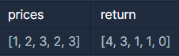

### - 문제설명
초 단위로 기록된 주식가격이 담긴 배열 prices가 매개변수로 주어질 때, 가격이 떨어지지 않은 기간은 몇 초인지를 return 하도록 solution 함수를 완성하세요.<br />

### [제한사항]
```
prices의 각 가격은 1 이상 10,000 이하인 자연수입니다.
prices의 길이는 2 이상 100,000 이하입니다.
```


### 입출력 예


<br />

### 입출력 예에 대한 설명
<b>입출력 예 #1</b>
<br />
1초 시점의 ₩1은 끝까지 가격이 떨어지지 않았습니다.<br />
2초 시점의 ₩2은 끝까지 가격이 떨어지지 않았습니다.<br />
3초 시점의 ₩3은 1초뒤에 가격이 떨어집니다. 따라서 1초간 가격이 떨어지지 않은 것으로 봅니다.<br />
4초 시점의 ₩2은 1초간 가격이 떨어지지 않았습니다.<br />
5초 시점의 ₩3은 0초간 가격이 떨어지지 않았습니다.<br />
<br />

---
조잡하게 arraylist를 이용해 풀었는데 <br />
찾아보니 stack을 이용해 푼 사람이 있었다.<br />

```java
import java.util.ArrayList;

class Solution {
    public int[] solution(int[] prices) {
        
        // 1은 2,3,4,5랑 비교
        // 2는 3,4,5랑 비교
        
        ArrayList<Integer> list = new ArrayList<>();
        
        for(int i=0; i<prices.length; i++){
            int sec = 0;
            
            // 맨 마지막일때
            if(i==prices.length-1){
                list.add(sec);
                break;
            }
            
            for(int j=i+1; j<prices.length; j++){ 
                if(prices[i] <= prices[j]){
                    sec++;
                }else if(prices[i] > prices[j]){
                    sec++;
                    //list.add(sec); 이걸추가하면 add가 아래랑 중복됌
                    break;
                }
            }
            list.add(sec);
        }
        
        int[] answer = new int[list.size()];
        
        for(int i=0; i<list.size(); i++){
            answer[i] = list.get(i);
        }
        
        return answer;
    }
}
```
<br />
---
<b>다른사람 풀이 참고</b>
<https://sas-study.tistory.com/256>
<br />