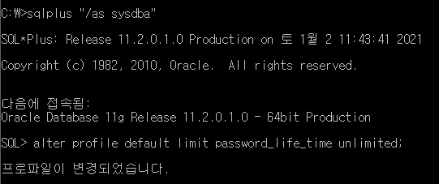

예전에 했던 프로젝트를 develop하기 위해 Oracle 로그인을 했더니 아래 사진과 같은 the password has expired 라는 에러가 뜨면서 되지 않았다. <br />


<br />

여기저기 알아본 결과 Oracle의 비밀번호는 180일마다 변경해줘야한다고 했다. 그러기 귀찮으니 변경주기를 없애기로 마음 먹었다.<br>



사진과 같이 cmd로 들어가서 C드라이브에 위치한 후(cd .. : 상위 폴더로 가는 명령어) sqlplus에 들어가면 되는데 그냥 들어갈 경우 이미 아이디가 막혀버린 상황이라 로그인이 안되므로 "/as sysdba" 을 입력해 시스템으로 들어간다.<br>

그리고 
```sql
ALTER PROFILE DEFAULT LIMIT password_life_time UNLIMITED;
```
을 입력해주면 비번변경주기가 무제한이 된다. <br> 
<br>


하지만 이렇게 입력하고 로그인을 해도 로그인 시도와 실패를 많이 한 탓인지 계정이 lock이 걸려 오류가 났다.<br />

```sql
ALTER USER scott IDENTIFIED BY tiger ACCOUNT UNLOCK;
ALTER USER scott UNLOCK;
```
둘중에 하나 입력하면 계정의 lock이 풀린다.<br>
<br>
하지만 끊기지 않은 오류의 고리..<br>


```sql
ALTER USER [username] IDENTIFIED BY [new pw];
```
을 입력해서 비번을 바꿔주니 드디어 해결되면서 로그인이 됐다.<br>
사서 오류를 만들었던 느낌이다.<br>