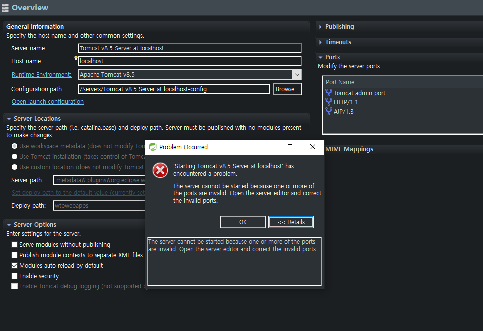
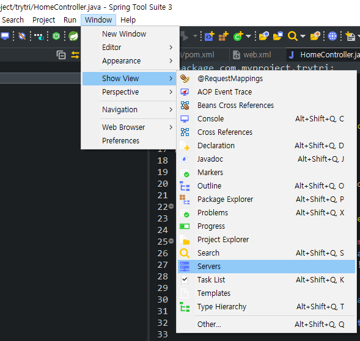
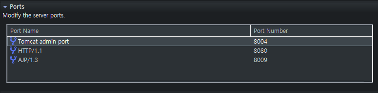

Spring project를 새로 하나 진행하기 위해 STS에 새로 workspace를 만들고 Spring MVC project를 생성했더니 아래와 같은 오류가 났다.
 
 

예전에도 항상 프로젝트를 생성하면 까먹고 포트넘버를 설정안했다가 같은 오류를 접하곤 했는데 제대로 기억하기 위해 블로그에 기록을 남겨 놓는다. 
 

사진과 같이 상단의 탭에서 <b>Window > Show View > Servers</b>를 클릭하면 Server탭이 뜨는데 그 안에 Tomcat 머시기를 클릭하면 아래와 같은 화면이 뜬다.
 
 

원래는 Tomcat admin port가 - 로 공란인 것을 볼 수 있는데 거기를 더블클릭해서 포트넘버를 지정해주면 된다. 나는 8004로 설정했다.

 