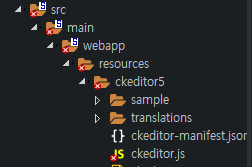

Spring 게시판에 적용할 수 있는 에디터를 찾다가 ckeditor5를 쓰기 위해 다운을 받았다. 
그리고 다운받은 것들을 resources폴더에 넣어줬는데 이상하게 ckeditor.js 파일에서 에러가 났다. 

 
<https://linguist79.tistory.com/8> 이 블로그를 보니 해결법이 있었다. 
프로젝트에서 오른쪽 마우스 버튼을 클릭해서 <b>Properties > Javascript > Include Path > Source</b>에 들어가서 Excluded를 선택하고 우측 Edit버튼을 클릭한다. 
Add 버튼을 눌러서 패턴을 <b>\*\*/파일이름.js</b> 를 추가하면 된다. 
이렇게까지 했는데 오류가 사라지지 않아서 STS상단에 <b>Project > clean</b> 을 실행했더니 해결됐다. 
 
정말 다양한 오류가 존재하는구나...
