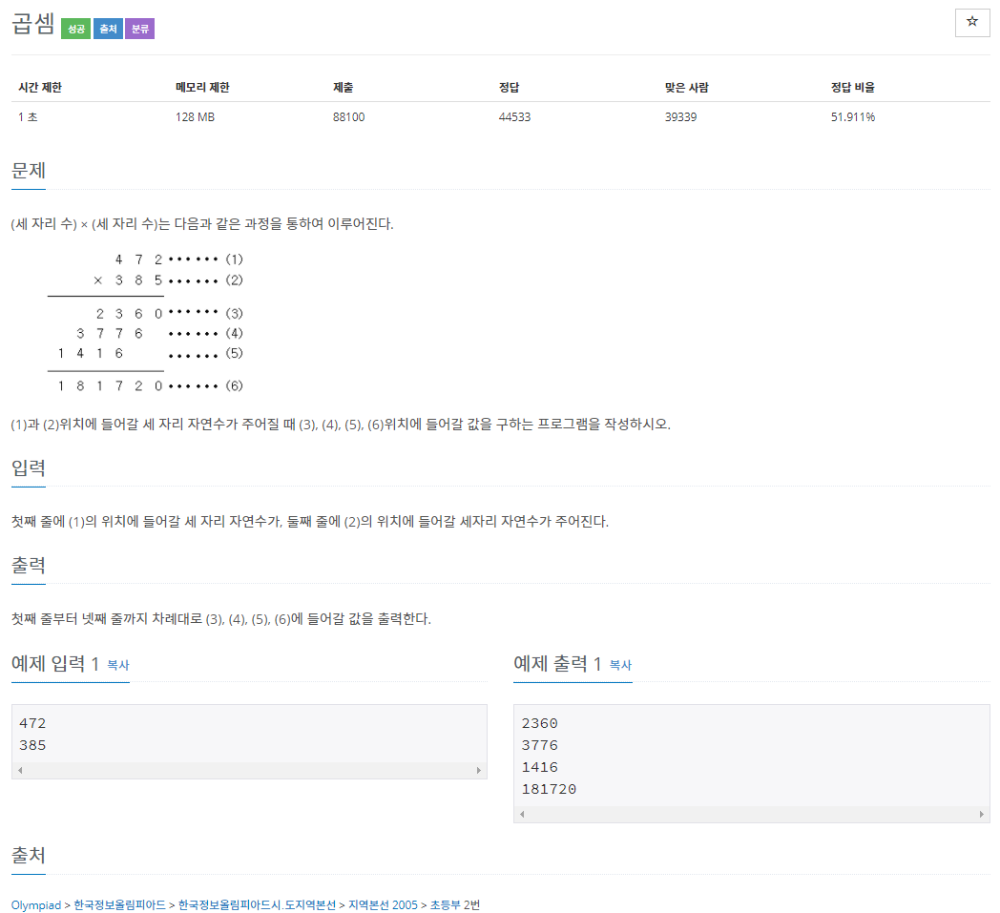

<hr>

### 문제풀이

#### 첫번째 방법: charAt 사용

```java
import java.io.IOException;
import java.util.Scanner;

public class Main {

	public static void main(String[] args) throws IOException {
		Scanner in = new Scanner(System.in);

		int a = in.nextInt();
		String b = in.next();

		in.close();

		int len = b.length();

		for(int i=len-1; i>=0; i--) {
			System.out.println(a*(b.charAt(i) - '0'));
		}
		System.out.println(a*(Integer.parseInt(b)));
	}
}
```

Scanner를 통해 첫번째수는 int로 두번째수는 String으로 받아서 charAt를 이용해서 풀었다.<br>
찾아보니 이 방법 말고도 더 있었다.<br>

#### 두번째 방법: 나머지와 나눗셈 연산 사용(Scanner)

```java
import java.io.IOException;
import java.util.Scanner;

public class Main {

	public static void main(String[] args) throws IOException {
		Scanner in = new Scanner(System.in);

		int a = in.nextInt();
		int b = in.nextInt();

		in.close();

		System.out.println(a*(b%10));
		System.out.println(a*(b%100/10));
		System.out.println(a*(b%100));
		System.out.println(a*b);
	}
}
```

#### 세번째 방법: 나머지와 나눗셈 연산 사용(bufferedReader)

```java
import java.io.BufferedReader;
import java.io.IOException;
import java.io.InputStreamReader;

public class Main {

	public static void main(String[] args) throws IOException {

		BufferedReader br = new BufferedReader(new InputStreamReader(System.in));

		int a = Integer.parseInt(br.readLine());
		int b = Integer.parseInt(br.readLine());

		br.close();

		StringBuilder sb = new StringBuilder();

		sb.append(a*(b%10));
		sb.append('\n');
		sb.append(a*(b%100/10));
		sb.append('\n');
		sb.append(a*(b%100));
		sb.append('\n');
		sb.append(a*b);

		System.out.println(sb);
	}
}
```

Scanner보다 bufferedReader가 입력받는 성능이 더 좋다고 한다.<br>
전체적인 풀이는 두번째와 같지만 Scanner를 bufferedReader로 이용하는 방법이다.<br>

#### 네번째 방법: character 배열 사용

```java
import java.io.BufferedReader;
import java.io.IOException;
import java.io.InputStreamReader;

public class Main_2588 {

	public static void main(String[] args) throws IOException {

		BufferedReader br = new BufferedReader(new InputStreamReader(System.in));

		int a = Integer.parseInt(br.readLine());
		String b = br.readLine();

		char[] arr = b.toCharArray();

		System.out.println(a*(arr[2]-'0'));
		System.out.println(a*(arr[1]-'0'));
		System.out.println(a*(arr[0]-'0'));
		System.out.println(a*Integer.parseInt(b));
	}
}
```

<br>
출처<br>
<https://st-lab.tistory.com/20>
