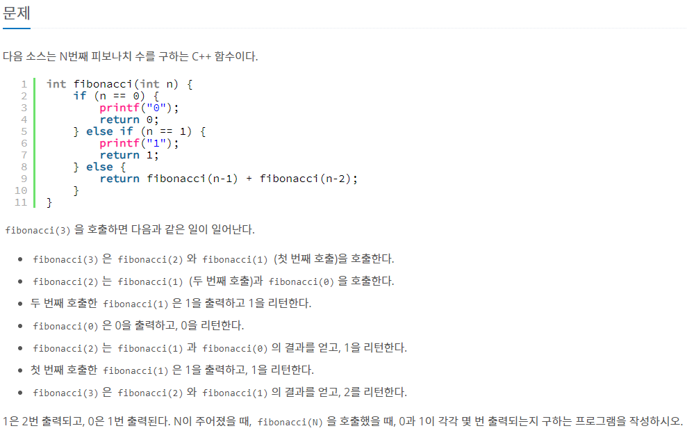
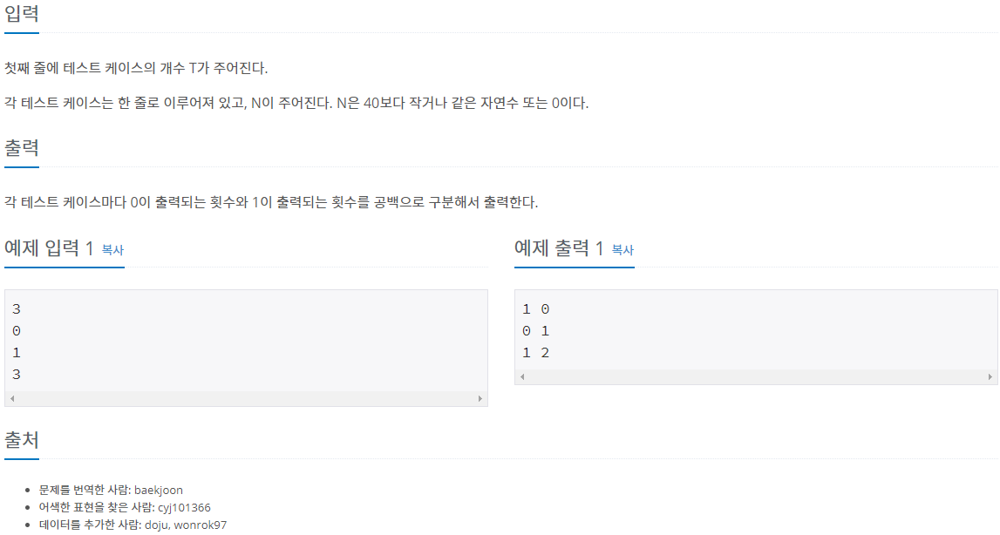

<hr>

### 문제풀이

#### 첫번째 방법: 시간초과 실패

```java
import java.io.BufferedReader;
import java.io.IOException;
import java.io.InputStreamReader;

public class Main {
	static int cnt_zero;
	static int cnt_one;
	public static void main(String[] args) throws NumberFormatException, IOException {
		BufferedReader br = new BufferedReader(new InputStreamReader(System.in));

		int t = Integer.parseInt(br.readLine());;	// 테스트 케이스 개수

		int[] arr = new int[t];

		for(int i=0; i<t; i++) {
			arr[i] = Integer.parseInt(br.readLine());
		}

		for(int i=0; i<t; i++) {
			fibonacci(arr[i]);
			System.out.println(cnt_zero + " " + cnt_one);
			cnt_zero = 0;
			cnt_one = 0;
		}
		br.close();
	}

	public static int fibonacci(int n) {
		if(n == 0) {
			cnt_zero++;
			return 0;
		}else if(n == 1) {
			cnt_one++;
			return 1;
		}else {
			return fibonacci(n-1) + fibonacci(n-2);
		}
	}
}
```

0과 1이 나올때는 일일이 카운트 해주는 방식으로 코드를 작성해봤는데 결과는 잘 나오지만, 시간 초과로 실패했다.<br>

#### 두번째 방법: 이차배열 이용

```java
import java.io.BufferedReader;
import java.io.IOException;
import java.io.InputStreamReader;

public class Main {

	public static void main(String[] args) throws NumberFormatException, IOException {
		BufferedReader br = new BufferedReader(new InputStreamReader(System.in));

		int t = Integer.parseInt(br.readLine());;	// 테스트 케이스 개수

		int[] arr = new int[t];

		for(int i=0; i<t; i++) {
			arr[i] = Integer.parseInt(br.readLine());
		}

		int[][] fibonacciSet = new int[41][2];

		fibonacciSet[0][0] = 1;
		fibonacciSet[0][1] = 0;
		fibonacciSet[1][0] = 0;
		fibonacciSet[1][1] = 1;

        for (int i = 2; i < fibonacciSet.length; i++) {
            fibonacciSet[i][0] = fibonacciSet[i - 1][1];
            fibonacciSet[i][1] = fibonacciSet[i - 1][0] + fibonacciSet[i - 1][1];
        }

        for (int input : arr) {
            System.out.println(fibonacciSet[input][0] + " " + fibonacciSet[input][1]);
        }
	}
}
```

다르게 푼 사람들 보니까 기존의 피보나치 함수를 이용하지 않고,<br>
`f(n) = (f(n-1)의 f(0)개수와 f(1)개수의 합) * f(1) + (f(n-1)의 f(1)의 개수) * f(0)` 이라는 점화식을 도출하여 문제를 푸셨다.<br>
<br>

출처<br>
<https://bellog.tistory.com/62>
