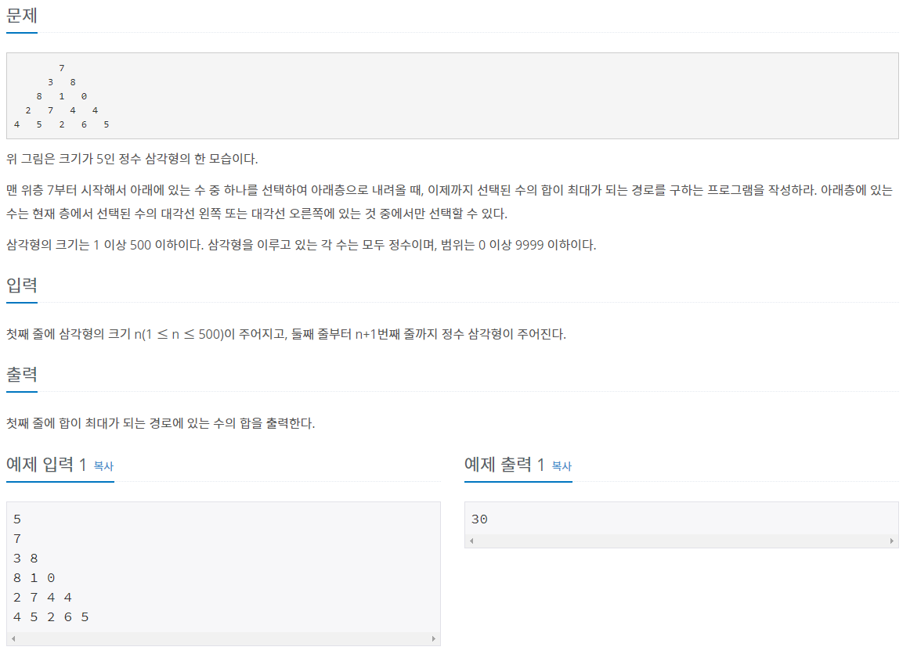

[문제링크](https://www.acmicpc.net/problem/1932)



<hr>

### 알아야 할 개념

### 문제풀이

#### 첫번째 방법

```java

```

시간초과로 실패했다. 시간복잡도를 파악하는 능력을 길러야하는데 아직은 푸는데 급급해서 신경을 못쓰고있다.<br>

#### 두번째 방법:

```java

```

다르게 푼 사람들 보니까 기존의 피보나치 함수를 이용하지 않고,<br>
`f(n) = (f(n-1)의 f(0)개수와 f(1)개수의 합) * f(1) + (f(n-1)의 f(1)의 개수) * f(0)` 이라는 점화식을 도출하여 문제를 푸셨다.<br>
<br>

출처<br>
<https://st-lab.tistory.com/131>
