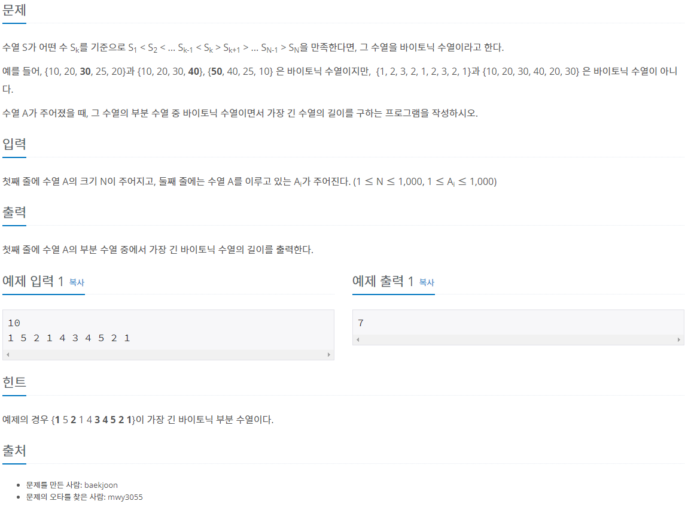

<hr>

### 알아야 할 개념

### 문제풀이

#### 첫번째 방법: 시간초과 실패

```java
import java.io.BufferedReader;
import java.io.IOException;
import java.io.InputStreamReader;
import java.util.StringTokenizer;

public class Main {

	public static void main(String[] args) throws IOException {
		BufferedReader br = new BufferedReader(new InputStreamReader(System.in));

		boolean flag = true;

		while(flag) {

			String str = br.readLine();

			StringTokenizer st = new StringTokenizer(str, " ");
			int a = Integer.parseInt(st.nextToken());
			int b = Integer.parseInt(st.nextToken());
			int c = Integer.parseInt(st.nextToken());

			if(a==-1 && b==-1 && c==-1) {
				flag = false;
				break;
			}

			int answer = func(a,b,c);

			System.out.println("w("+a+", "+b+", "+c+") = " + answer);
		}

		br.close();
	}

	static int func(int a, int b, int c) {
		if(a<=0 || b<=0 || c<=0) {
			return 1;
		}else if(a>20 || b>20 || c>20) {
			return func(20,20,20);
		}else if(a<b && b<c) {
			return func(a,b,c-1) + func(a,b-1,c-1) - func(a,b-1,c);
		}else {
			return func(a-1,b,c) + func(a-1,b-1,c) + func(a-1,b,c-1) - func(a-1,b-1,c-1);
		}
	}
}
```

시간초과로 실패했다. 시간복잡도를 파악하는 능력을 길러야하는데 아직은 푸는데 급급해서 신경을 못쓰고있다.<br>

#### 두번째 방법:

```java

```

다르게 푼 사람들 보니까 기존의 피보나치 함수를 이용하지 않고,<br>
`f(n) = (f(n-1)의 f(0)개수와 f(1)개수의 합) * f(1) + (f(n-1)의 f(1)의 개수) * f(0)` 이라는 점화식을 도출하여 문제를 푸셨다.<br>
<br>

출처<br>
<https://st-lab.tistory.com/190>
