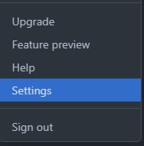
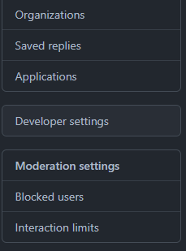
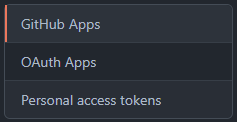

얼마 전에 Github 비번을 변경했는데 블로그 업데이트를 위해 commit 후 push를 하려는데 오류가 났다.<br>
찾아보니 git 명령어를 통해서 간단하게 해결할 수 있다 했다.<br>
<br>

<h3>github에 변경된 비밀번호 로컬에 반영하는 방법</h3>
<hr>

일단 git bash를 실행해서 .git이 있는 아무 디렉토리로 이동한 후<br>

```
% git config --unset credential.helper
```

를 입력한다. 아무 출력없이 끝날텐데 그 다음

```
% git push origin master
```

명령어를 입력해서 push를 하면 github의 username과 password를 입력하라고 나온다.<br>
그런데 여기서 또 다른 오류가 났다. 분명 검색 결과로는 여기서 아이디와 비번을 입력하면 오류 해결인데!<br>

```
remote: Support for password authentication was removed on August 13, 2021.
Please use a personal access token instead.
remote: Please see https://github.blog/2020-12-15-token-authentication-requirements-for-git-operations/
for more information.
```

이렇게 8/13일 부로 비밀번호 인증서비스가 종료되고 개인 엑세스 토큰을 이용해야 한다고 오류메세지가 떴다.<br>
<br>

<h3>personal access token 생성하는 방법</h3>
<hr>
<b>1. 깃허브에서 Settings -> Developer settings -> Personal access tokens 클릭</b>
<br>




<br>
<b>2. Generate new token 클릭</b>


<br>
<b>3. 토큰 이름 넣고 기간 설정하고 범위 선택 후 생성</b>
<br>
<b>4. 생성 후 페이지 나가지말고 뜨는 토큰 복사하기!(나가면 토큰 사라짐)</b>
<br>

<hr>

<br>
이렇게 token까지 생성을 완료했다면 다시 push 시도 후 뜨는 비밀번호란에 토큰을 입력하면 제대로 실행되는 것을 볼 수 있다.

참고<br>
<https://hyeon9mak.github.io/change-git-local-password>
<https://docs.github.com/en/authentication/keeping-your-account-and-data-secure/creating-a-personal-access-token>
