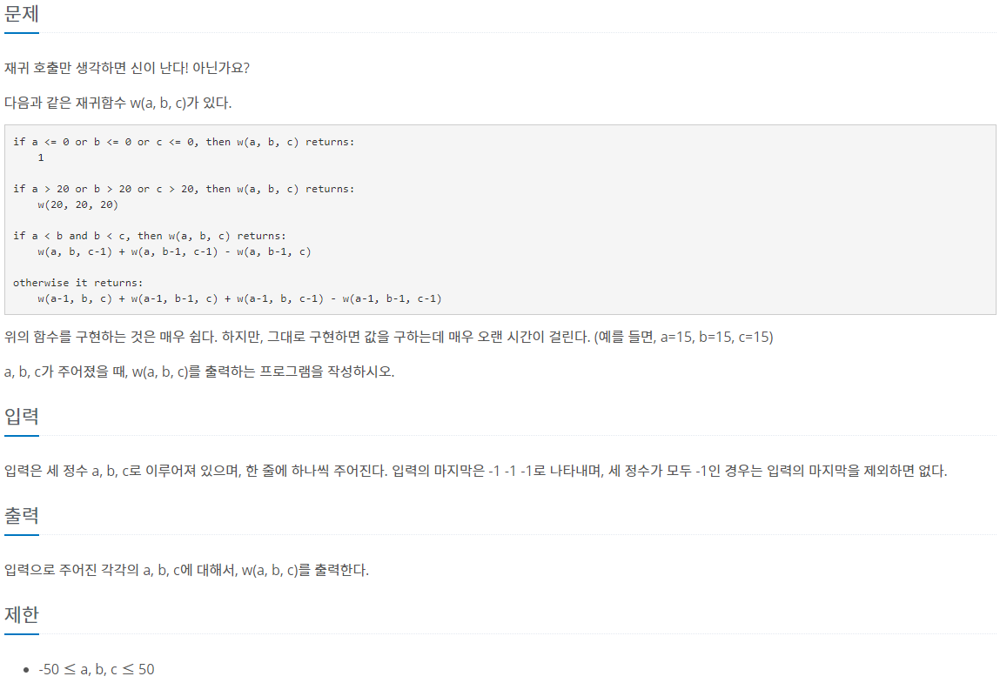
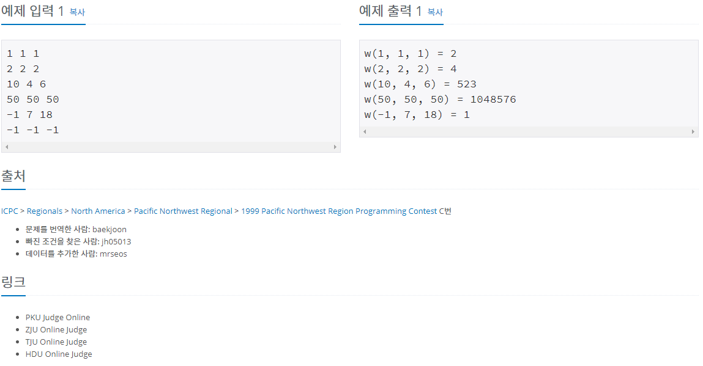

[문제링크](https://www.acmicpc.net/problem/9184)



<hr>

### 알아야 할 개념

#### 메모이제이션(memoization)

동적 계획법(dynamic programming)의 핵심 기술로 동일한 계산을 반복해야 할 때, 이전에 계산한 값들을 메모리에 저장함으로써 동일한 계산의 반복 수행을 제거하여 프로그램 실행 속도를 빠르게 하는 방법이다. 보통 예시로 피보나치 수열을 사용한다.<br>
출처 <https://kimdohyeon.tistory.com/43>

### 문제풀이

#### 첫번째 방법: 시간초과 실패

```java
import java.io.BufferedReader;
import java.io.IOException;
import java.io.InputStreamReader;
import java.util.StringTokenizer;

public class Main_9184 {

	public static void main(String[] args) throws IOException {
		BufferedReader br = new BufferedReader(new InputStreamReader(System.in));

		boolean flag = true;

		while(flag) {

			String str = br.readLine();

			StringTokenizer st = new StringTokenizer(str, " ");
			int a = Integer.parseInt(st.nextToken());
			int b = Integer.parseInt(st.nextToken());
			int c = Integer.parseInt(st.nextToken());

			if(a==-1 && b==-1 && c==-1) {
				flag = false;
				break;
			}

			int answer = func(a,b,c);

			System.out.println("w("+a+", "+b+", "+c+") = " + answer);
		}

		br.close();
	}

	static int func(int a, int b, int c) {
		if(a<=0 || b<=0 || c<=0) {
			return 1;
		}else if(a>20 || b>20 || c>20) {
			return func(20,20,20);
		}else if(a<b && b<c) {
			return func(a,b,c-1) + func(a,b-1,c-1) - func(a,b-1,c);
		}else {
			return func(a-1,b,c) + func(a-1,b-1,c) + func(a-1,b,c-1) - func(a-1,b-1,c-1);
		}
	}
}
```

시간초과로 실패했다. 시간복잡도를 파악하는 능력을 길러야하는데 아직은 푸는데 급급해서 신경을 못쓰고있다.<br>

#### 두번째 방법: Scanner와 메모이제이션 사용

```java
import java.util.Scanner;

class Main_9184 {

    static int memo[][][] = new int[21][21][21];

    public static void main(String[] args) {
        Scanner in = new Scanner(System.in);

        while (true) {
            int a = in.nextInt();
            int b = in.nextInt();
            int c = in.nextInt();

            // 모든 입력값이 -1이면 while문을 빠져나온다.
            if (a == -1 && b == -1 && c == -1) {
                break;
            }

            System.out.printf("w(%d, %d, %d) = %d\n", a, b, c, w(a, b, c));
        }
    }

    static int w(int a, int b, int c) {
        // a, b, c가 범위를 벗어나지 않으면서 메모이제이션이 되어있는 경우
        if(range(a, b, c) && memo[a][b][c] != 0) {
            return memo[a][b][c];
        }

        if (a <= 0 || b <= 0 || c <= 0) {
            return 1;
        } else if (a > 20 || b > 20 || c > 20) {
            return memo[20][20][20] = w(20,20,20);
        } else if (a < b && b < c) {
            return memo[a][b][c] = w(a, b, c-1) + w(a, b-1, c-1) - w(a, b-1, c);
        } else {
            return memo[a][b][c] = w(a-1, b, c) + w(a-1, b-1, c) + w(a-1, b, c-1) - w(a-1, b-1, c-1);
        }
    }

    static boolean range(int a, int b, int c) {
        return 0 <= a && a <= 20 && 0 <= b && b <= 20 && 0 <= c && c <= 20;
    }
}
```

다르게 푼 사람들 보니까 기존의 피보나치 함수를 이용하지 않고,<br>
`f(n) = (f(n-1)의 f(0)개수와 f(1)개수의 합) * f(1) + (f(n-1)의 f(1)의 개수) * f(0)` 이라는 점화식을 도출하여 문제를 푸셨다.<br>
<br>

출처<br>
<https://st-lab.tistory.com/190>
