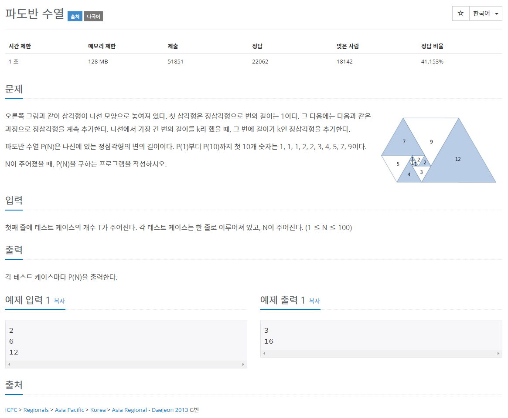

[문제링크](https://www.acmicpc.net/problem/9461)


<hr>

<!-- ### 알아야 할 개념

#### 메모이제이션(memoization)

동적 계획법(dynamic programming)의 핵심 기술로 동일한 계산을 반복해야 할 때, 이전에 계산한 값들을 메모리에 저장함으로써 동일한 계산의 반복 수행을 제거하여 프로그램 실행 속도를 빠르게 하는 방법이다. 보통 예시로 피보나치 수열을 사용한다.<br>
출처 <https://kimdohyeon.tistory.com/43> -->

### 문제풀이

#### 첫번째 방법: 틀림

1, 1, 1, 2, 2, 3, 4, 5, 7, 9 의 결과값으로 n=(n-2)+(n-3)이라는 규칙을 발견해 적용해서 풀었다.<br>
또한 Scanner보다는 BufferedReader 속도가 빠르다고해서 후자로 풀었는데 계속 틀렸다.<br>

```java
import java.io.BufferedReader;
import java.io.IOException;
import java.io.InputStreamReader;

class Main_9461 {

    static long memo[];

    public static void main(String[] args) throws IOException {

        //Scanner보다 BufferedReader가 더 빠름
        BufferedReader br = new BufferedReader(new InputStreamReader(System.in));

        int n = Integer.parseInt(br.readLine());

        memo = new long[n+1];
        System.out.println(padovan(n));
    }

    static long padovan(int n) {

        // 이미 배열에 값이 저장된 경우
        if (n >= 1 && n <= 100 && memo[n] != 0L) {
            return memo[n];
        }
        if (n >= 1 && n <= 3) {
            return memo[n] = 1L;
        }else {
            return memo[n] = padovan(n-2) + padovan(n-3);
        }
    }
}
```

#### 두번째 방법: t추가

아무리 생각해도 맞는데 왜 오류가 나나 싶었는데 알고보니 문제를 잘못읽었다. 입력을 한번만 하면되는줄 알았는데 t라는 수행횟수를 추가했어야 했다. while문을 통해 입력횟수를 적용했더니 바로 성공... 문제를 잘읽자!!!<br>

```java
import java.io.BufferedReader;
import java.io.IOException;
import java.io.InputStreamReader;

class Main_9461 {

    static long memo[] = new long[101];

    public static void main(String[] args) throws IOException {

        //Scanner보다 BufferedReader가 더 빠름
        BufferedReader br = new BufferedReader(new InputStreamReader(System.in));

        int T = Integer.parseInt(br.readLine());

        while (T-- > 0) {
            int n = Integer.parseInt(br.readLine());
            System.out.println(padovan(n));
        }
        br.close();
    }

    static long padovan(int n) {
        memo[1] = memo[2] = memo[3] = 1L;
        // 이미 배열에 값이 저장된 경우
        if (n >= 1 && n <= 100 && memo[n] == 0L) {
            memo[n] = padovan(n-2) + padovan(n-3);
        }
        return memo[n];
    }
}
```

다른사람 문제풀이<br>
<https://st-lab.tistory.com/127>
<br>

<https://girawhale.tistory.com/20>
