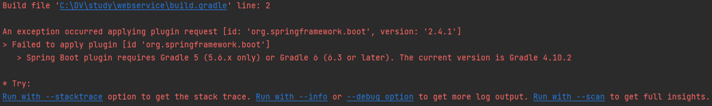
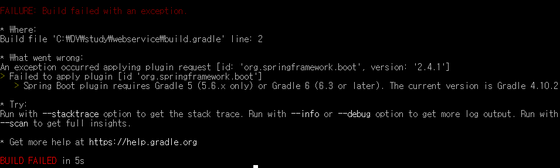

원래 진행하던 프로젝트의 SpringBoot 버전을 올리고 build.gradle도 수정하려니 아래와 같은 오류가 났다. 

 
Gradle 5 또는 Gradle 6으로 업데이트를 해야한다기에 Gradle 6으로 변경하기로 했다. 

<h3>Gradle 버전 변경하는 방법(Windows)</h3>

1. cmd로 들어가서 프로젝트가 있는 디렉토리로 이동한다. 
2. 아래 명령어를 입력한다. 나는 6.7.1로 바꿀꺼기 때문에 gradlew wrapper --gradle-version 6.7.1 입력
    \* Gradle 5버전부턴 Java 8 이상을 요구
    
    
   이렇게 하면 gradle 업뎃이 완료되는게 정상인데 나는 또 오류가 났다.

이런 오류가 뜬 경우 혹시 build.gradle에서 이미 오류가 난 상태가 아닌지 확인하고 그렇다면 오류 나기 전 버전으로 롤백한 뒤 gradle을 업데이트하면 제대로 되는 걸 확인할 수 있다. 
