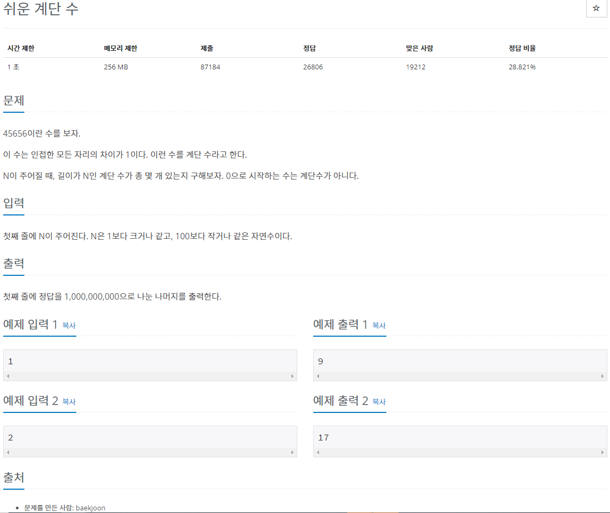

[문제링크](https://www.acmicpc.net/problem/10844)



<hr>

<!-- ### 알아야 할 개념

#### 삽입정렬(Insertion sort)

삽입 정렬은 자료 배열의 모든 요소를 앞에서부터 차례대로 이미 정렬된 배열 부분과 비교하여, 자신의 위치를 찾아 삽입함으로써 정렬을 완성하는 알고리즘이다. 배열이 길어질수록 효율이 떨어진다.<br>

추가내용 참고 <https://st-lab.tistory.com/179>
<br>

#### 버블정렬(Bubble sort)

거품(버블) 정렬은 두 인접한 원소를 검사하여 정렬하는 방법이다. 시간 복잡도가 상당히 느리지만, 코드가 단순하기 때문에 자주 사용된다. 원소의 이동이 거품이 수면으로 올라오는 듯한 모습을 보이기 때문에 지어진 이름이다. 양방향으로 번갈아 수행하면 칵테일 정렬이 된다.

추가내용 참고 <https://st-lab.tistory.com/195>
<br> -->

### 문제풀이

#### 첫번째 방법: Scanner + Top-Down

```java
import java.util.Scanner;

public class Main {

	static Long[][] dp;
	static int N;
	final static long MOD = 1000000000;

	public static void main(String[] args) {
		Scanner in = new Scanner(System.in);

		N = in.nextInt();
		dp = new Long[N + 1][10];

		// 첫번째 자릿수는 1로 초기화
		for(int i = 0; i < 10; i++) {
			dp[1][i] = 1L;
		}

		long result = 0;

		// 마지막 자릿수인 1~9까지의 경우의 수를 모두 더해준다.
		for(int i = 1; i <= 9; i++) {
			result += recur(N, i);
		}
		System.out.println(result % MOD);
	}

	/*
	 dist 는 자릿수, val은 자릿값을 의미함

	 첫째 자리수는 각 val이 끝이기 때문에
	 경우의 수는 1밖에 없다. 즉, dp[1]의 각 자릿값은
	 1로 초기화 되어있어야한다.
	*/

	static long recur(int digit, int val) {

		// 첫째 자리수에 도착한다면 더이상 탐색할 필요 없음
		if(digit == 1) {
			return dp[digit][val];
		}

		// 해당 자리수의 val값에 대해 탐색하지 않았을 경우
		if(dp[digit][val] == null) {
			// val이 0일경우 다음은 1밖에 못옴
			if(val == 0) {
				dp[digit][val] = recur(digit - 1 ,1);
			}
			// val이 1일경우 다음은 8밖에 못옴
			else if(val== 9) {
				dp[digit][val] = recur(digit - 1, 8);
			}
			// 그 외의 경우는 val-1과 val+1 값의 경우의 수를 합한 경우의 수가 됨
			else {
				dp[digit][val] = recur(digit - 1, val - 1) + recur(digit - 1, val + 1);
			}
		}
		return dp[digit][val] % MOD;
	}
}
```

<br>
참고<br>
<https://st-lab.tistory.com/134>
