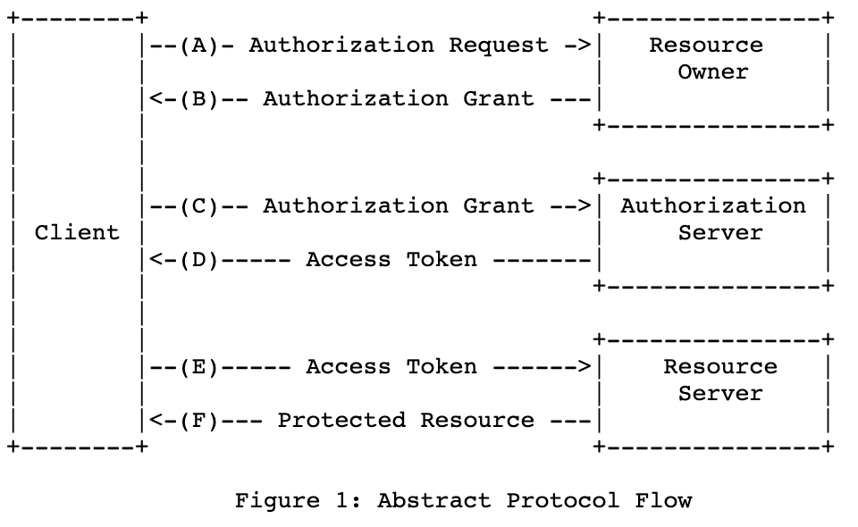

### OAuth란?

OpenID Authentication의 줄임말로서, 말 그대로 인터넷 사용자들이 비밀번호를 제공하지 않고 다른 웹사이트 상의 자신들의 정보로 웹 사이트나 애플리케이션의 접근 권한을 부여할 수 있는 공통적인 수단으로 사용되는, 접근 위임을 위한 개방형 표준이다. 주로, 여러 기업들에 의해 사용되는데, 아마존, 구글, 페이스북, 마이크로소프트 국내에서는 네이버 카카오 등이 있다. 현재는 OAuth1.0에서 발견된 취약점으로 OAuth2.0으로 대체되어 사용되고 있다.

### Oauth1.0과 OAuth2.0의 차이점

1. 간단 
   JWT Bearer 토큰 인증방식을 사용하여, signature가 필요없어서 간단 

2. 인증방법 다양 
   HMAC 암호화만 사용하던 1.0과는 다르게 여러가지 인증방시글 제공하여 시나리오, 브라우저별로 대응 가능 
3. 대형서비스로의 확장성 
   커다란 서비스를 하기 위해서는 인증서버 분리, 인증서버 다중화가 돼야하는데, 2.0은 인증부분을 확실히 다른 부분으로 분리함으로써 인증서버가 다중화 가능 

### OAuth2.0 동작 방식

#### 출처

<https://berrrrr.github.io/programming/2019/11/03/oauth1-vs-oauth2/>
<https://velog.io/@devsh/OAuth-2.0-%EC%97%90-%EB%8C%80%ED%95%98%EC%97%AC>
