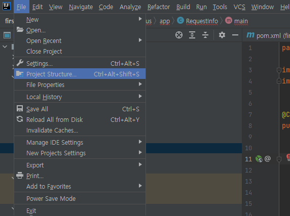
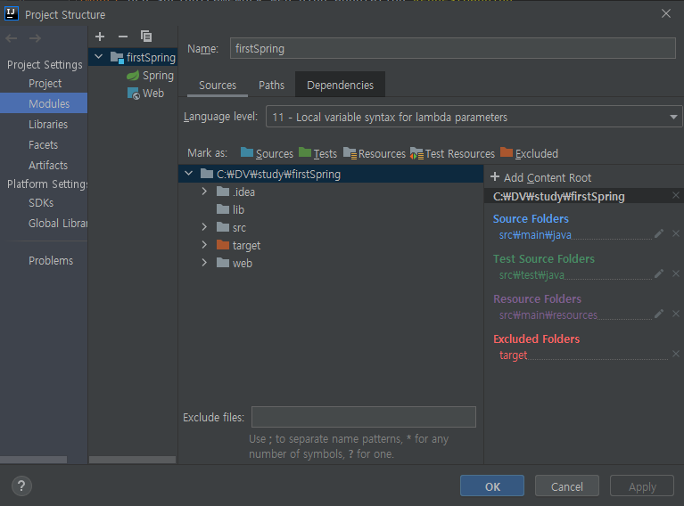
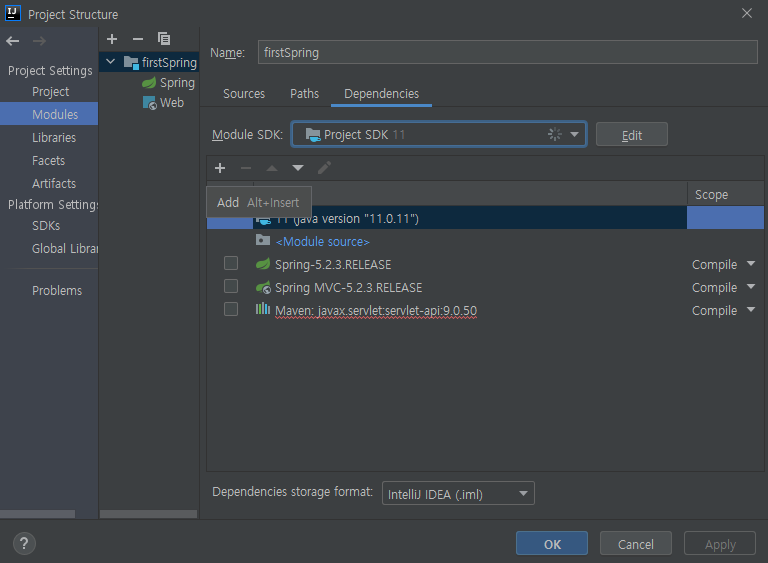
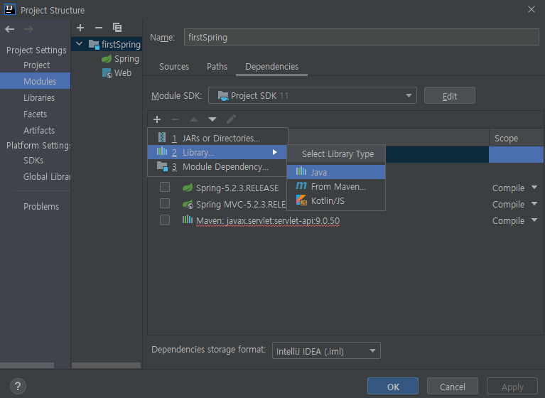
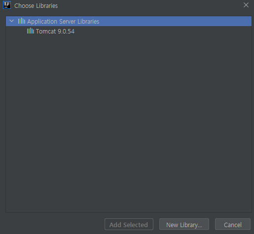

인텔리제이에서 HttpServletRequest를 사용하기 위해서는 Dependencies에 톰캣 라이브러리를 추가해야 한다. 

### 추가 방법

- Project Structure -> Modules -> Dependencies 를 들어간다.

- Add(+) 선택 -> Library -> From Maven

- Tomcat 사용하는 버전을 선택한다.
  참고로 톰캣이 연결돼어있지 않다면 이 창에서 아무것도 찾을 수 없으니 일단은 IntelliJ와 Tomcat을 꼭 먼저 연동해야한다. 
  [연결방법](https://goddaehee.tistory.com/247)

#### 출처

<https://xzio.tistory.com/1287>
