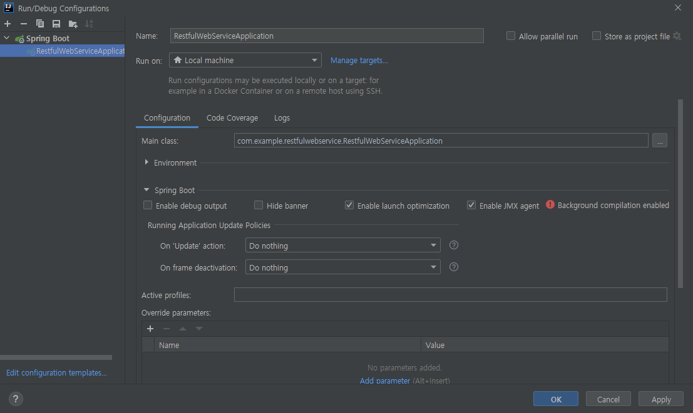

Rest api를 만들면서 실행을 하는데 기본 클래스를 찾을 수 없다는 오류가 났다. 자세히 살펴보니 현재 클래스가 있는 패키지 위치가 아닌 다른 위치로 설정돼있었다.<br>

### 오류 전문

<details>
<summary>더보기</summary>
<div markdown="1">

```
오류: 기본 클래스 com.example.restfulwebservice.helloworld.RestfulWebServiceApplication을(를) 찾거나 로드할 수 없습니다.
```

</div>
</details>
<br>

### 해결방법

- 인텔리제이 상단에 Run -> Edit Configurations 선택

- Configuration 하단에 Main class: 옆에 패키지 위치를 현재 main class 위치에 맞게 수정<br>
  내 경우는 com.example.restfulwebservice.helloworld.RestfulWebServiceApplication 에서 <br>
  com.example.restfulwebservice.RestfulWebServiceApplication 로 바꿔줬다.<br>

  

<br>
이렇게 하면 제대로 실행이 되는 것을 볼 수 있다.

#### 출처

<https://jazzodevlab.tistory.com/71>
