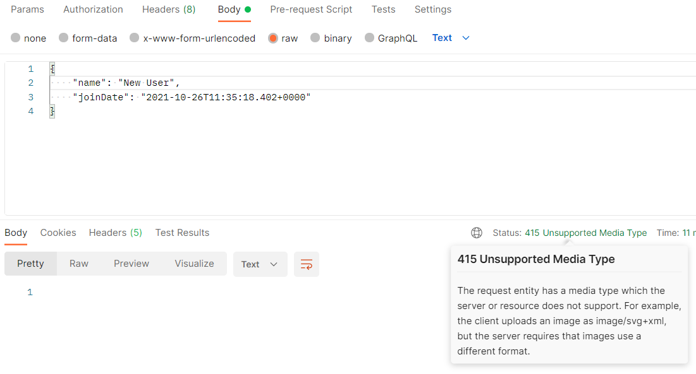
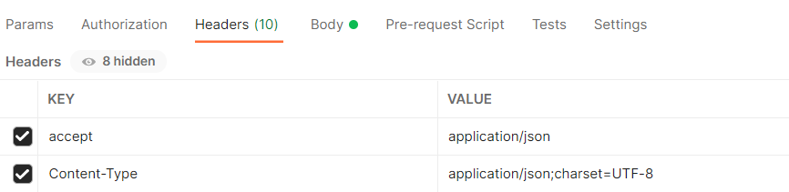

Postman을 통해 rest api 중에 데이터가 save되는 것을 실행하려고 하는데 415 unsupported media type 이라는 오류가 났다. 

### 오류 전문

더보기

 

### 해결방법

- Header에서 <b>accept: application/json, Content-Type: application/json;charset=UTF-8</b> 입력 
  

 
이렇게 하면 제대로 실행이 제대로 된다.

<!-- #### 출처

<https://jazzodevlab.tistory.com/71> -->
